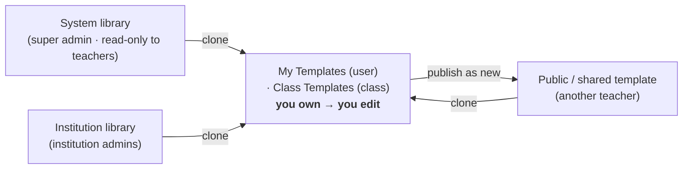
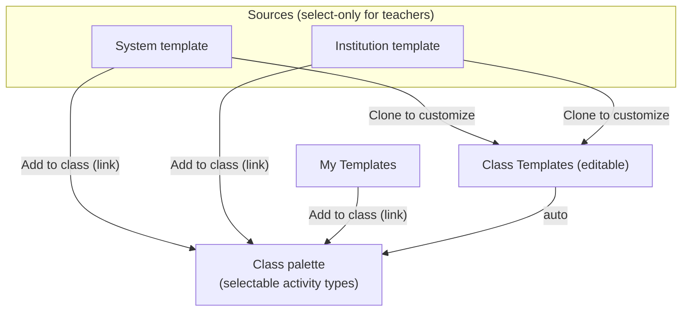
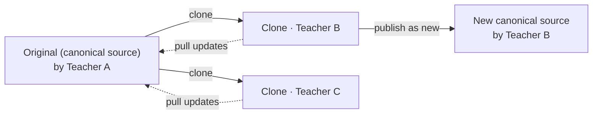
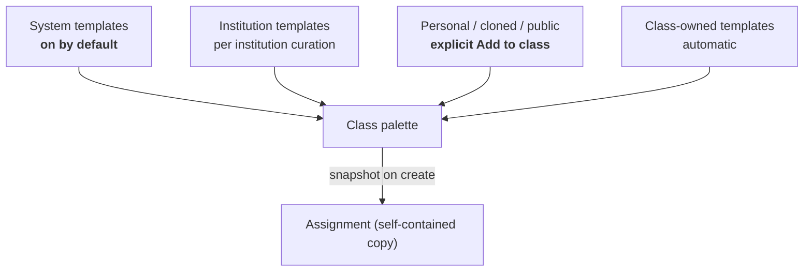

# Activity Templates Plan

Move activity types from **hardcoded TypeScript** to **database-backed templates** that
can be authored, cloned, shared, and curated per class and institution — while keeping the
existing registry as the seed for built-in templates and the safety fallback.

> Status: **planning**. This doc proposes the data model, resolution strategy, ownership &
> sharing model, curation, UI surfaces, and a phased rollout. Open decisions are flagged in §12.

---

## 1. Motivation

Today an "activity type" (Learning, Assessment, Speaking Practice, Code Review) is a
hardcoded `ActivityTypeDefinition` in `src/lib/activityTypes/*.ts`. Adding or tweaking a
type means a code change + deploy (see `dev-docs/adding-activity-types.md`). We want:

1. **Predefined platform templates** shipped with the product (the current 4 types).
2. **User-authored templates** — a teacher creates their own, **clones** others', and **shares**.
3. **Per-class curation** — a teacher curates a small, intentional set of templates per class.
4. **Per-institution library + curation** — an institution admin maintains an institution
   template library and restricts what applies to their institution; classes curate within it.

The codebase already has the two patterns we need.
- The **activity-type registry** defines a clean, serializable `ActivityTypeDefinition`
  shape — it maps almost 1:1 onto a DB row.
- The **settings system** (`src/lib/settings/`, `setting_values` table) already does
  hierarchical institution → class resolution with clamping (`allowed_assessment_modes`
  is the precedent). We reuse this shape for curation rather than inventing one.

---

## 2. Current state (what we're replacing)

| Concern | Today | File |
|---|---|---|
| Type definitions | 4 hardcoded `ActivityTypeDefinition`s | `src/lib/activityTypes/{learning,assessment,speaking_practice,code-review}.ts` |
| Registry | `Record<ActivityTypeKind, ActivityTypeDefinition>` | `src/lib/activityTypes/registry.ts` |
| Kind union | `"learning" \| "assessment" \| "speaking_practice" \| "code_review"` | `src/lib/activityTypes/types.ts` |
| Dropdown | `listActivityTypes()` → `AssignmentForm` | `src/components/Teacher/Assignments/AssignmentForm.tsx:1017` |
| Prompt seeding | `buildDefault{SystemPrompt,ConversationStart,EvaluationPrompt}` read the registry | `src/lib/promptTemplates.ts` |
| Labels (view) | `getActivityTypeLabels(kind)` re-resolved at render | QuestionCard / `Shared/QuestionView.tsx` |
| Generation copy | `getActivityTypeGenerationCopy(kind)` | `api/generate-rubric-and-answer/route.ts` |
| Server directives | ~~`buildMultimodalDirective` / `buildLanguageSupportDirective` hooks~~ — converted to plain `actionDirective` / `languageSupportDirective` data fields in Phase 0 | `src/lib/ai/multimodal-directives.ts` |
| Persisted on assignment | `activity_type` (text), plus **snapshotted** `bot_prompt_config`, `evaluation_prompt`, `feedback_focus` | `src/types/assignment.ts` |

**Crucial existing behavior — assignments already snapshot prompts.**
`handleActivityTypeChange` (`AssignmentForm.tsx:683`) expands the registry definition into
concrete `bot_prompt_config.system_prompt`, `conversation_start`, `evaluation_prompt`, and
`feedback_focus`, which are stored on the assignment. At runtime the assignment uses its
**own** stored prompts, not the registry. The registry is only consulted live for:
1. seeding when the teacher first picks a type, and
2. **labels / generation copy / server directives**, still resolved by `kind`.

That snapshot is the key to a low-risk migration and is the basis for the whole model below
(§4, decision 3): a template is the *source you copy from*, never a live dependency.

### The two server "directives" are just text

`buildMultimodalDirective()` and `buildLanguageSupportDirective()` looked like code but only
ever returned **strings** appended to the system prompt. **Converted in Phase 0** into ordinary,
editable **template prompt fields** (`actionDirective`, `languageSupportDirective`) —
removing the last non-serializable part of a definition, so a template is fully self-describing
data (§6.3).

---

## 3. Goals & non-goals

**Goals**
- Templates live in the DB; the 4 current types become seeded **system templates**.
- Three editable **libraries** — personal, class, institution — plus the read-only system
  library; teachers author, **clone**, and share.
- A **curated, per-class palette** so teachers see only the activity types they need.
- Keep the hardcoded registry as **fallback** and **seed source** (no regression if the DB is
  empty or a template is missing).
- Existing assignments keep working untouched (they already snapshot prompts).

**Non-goals (this phase)**
- A visual prompt builder / WYSIWYG. Templates are authored as prompt text + labels.
- Full version history / branching. Cloning is **flat** (single level); audit history is an
  optional later add-on (§7.9).
- Changing the multimodal action **kinds** (`adding-multimodal-actions.md`) — schemas, handlers,
  and per-action directives stay code-defined; a template *references* action kinds by id. (The
  *type-attachment wiring* — which actions auto-enable / drive the bulb button — **does** move
  onto the template; see the action↔type inversion in Appendix A.)
- A public **community gallery / browse surface** + moderation tooling (report queues, takedown).
  Public sharing itself **is in scope**: an author can set `visibility='public'` and **any teacher
  can clone it** — but discovery is via a **shared link** (the template's id / detail page), not a
  platform-wide browsable gallery. No `institution` visibility tier.
- **Per-class curation / institution allow-lists** (the enablement table, precedence,
  `allow_child_override`, `default_template_inclusion`) — **deferred to Phase 3**. Phase 2 uses a
  simple, uncurated class palette (§8).
- **Independent per-assignment prompt editing.** Assignments become **pure template snapshots**
  (edit the template, then pull) — the free-form per-assignment prompt overrides are removed (§6.3, §7.6).

---

## 4. Design decisions

1. **Template = serialized-definition variant + metadata.** One table, `activity_templates`,
   with a `definition jsonb` plus ownership / sharing / lineage columns. `definition` is
   **modeled on `ActivityTypeDefinition` but is not identical to it** — it is a **new zod schema**,
   not `z.infer` of the existing TS type: `name`/`description`/`visibility`/owner are **columns**
   (not in `definition`); `kind`/`label` are **dropped** (a template's identity is its row `id`,
   not a closed `kind`); and the action↔type wiring (`autoActions`/`bulbAction`) is **added**
   (Appendix A). The shipped `/platform/templates` mockup (`src/components/Platform/Templates/types.ts`)
   already reflects this variant. It carries: systemPrompt, conversationStart, evaluationPrompt,
   evaluationSystemPersona, labels, defaultFeedbackFocusAreas, defaults, generation, and the
   directive fields (`actionDirective`, `endConditionInstruction`, `languageSupportDirective`).

2. **Registry = bootstrap seed + legacy fallback; the DB is the source of truth.** A resolver
   (`resolveActivityTemplate`) returns a DB template when present (by `id`), else the built-in
   registry entry by `kind`. The 4 built-ins are seeded as `owner_scope='system'` rows and
   **managed thereafter by platform super admins through the same gallery/editor** every other
   library uses (add / edit / delete) — for full consistency. The registry remains only as the
   one-time seed and as the fallback for legacy `activity_type`-only assignments, so the app
   still works if a row is missing.

3. **Assignments _snapshot_ the template at creation (copy-on-create) — the safe model.**
   Picking a template copies its resolved definition onto the assignment, as the app already
   does for `bot_prompt_config`. The assignment is then **fully self-contained**: it never
   reads the template at runtime/view time, so a template later edited, archived, or
   **hard-deleted has zero effect** on existing assignments. `activity_template_id` is a
   **nullable provenance link (`ON DELETE SET NULL`)**, not a runtime dependency. Propagation
   is opt-in via an explicit **"Update from template"** pull (§7.6).

   **The snapshot is the _only_ per-assignment prompt state — no independent editing (resolved).**
   Assignments are **pure snapshots**: the only way to change an assignment's prompts is to edit
   the source template and **pull**. The free-form per-assignment prompt overrides
   (`AssignmentForm` / `MoreOptionsAIBot`) are **removed** (Phase 2). This gives one editing
   surface (the template) and one propagation verb (pull), eliminating the confusing middle
   ground where an assignment could both diverge locally *and* claim a template lineage (§6.3).

4. **Two orthogonal axes — never conflate them.** This is the backbone of the whole design:
   - **Ownership** = *who may edit* a template. Set by the **library it lives in** (§5).
   - **Availability** = *what is selectable in a class* (the class palette, §8).

   Edit rights come from ownership, **never** from a template being available in, or used by,
   a class. Two distinct verbs map to the two axes:

   | Verb | Axis | Effect |
   |---|---|---|
   | **Clone** (and **Create**) | ownership | makes a copy **you own**, in the library you're in |
   | **Add to class** | availability | a membership **link** into the class palette (no copy) |

5. **Ownership = create/clone-in-context (three libraries + system).** A template is owned by
   the library you create or clone it in — and the section you're standing in *is* that
   library, so role-gating is automatic (§7.2). New-in-class defaults to **class-owned**
   (co-editable); new-in-personal to **user-owned**; new-in-institution-admin to
   **institution-owned**; system is read-only catalog.

6. **Cloning is flat, with an upstream link.** You clone **only from the canonical source** —
   you cannot fork a fork, so clones form a flat *star*, not a tree. Each clone keeps a
   `forked_from` link and can **pull upstream** updates (confirm-then-overwrite); the original
   author is credited (cached so credit survives deletion). To re-share a customized clone, use
   **"Publish as new template"**, which starts a fresh lineage (§7.4).

7. **Directives are data, not code.** The former directive *functions* only produced text, so
   that text moves into the template `definition` as editable prompt fields (optional
   `actionDirective` and `endConditionInstruction`, plus inline `{{#if support_language}}`
   behavior). No `behavior_key` and no per-type code registry — templates are fully
   self-describing and authors edit this behavior directly (§6.3). The runtime
   `endConversation` schema field stays as the dumb, reliable *signal*; the template field only
   drives *when* it fires (the policy).

8. **Curation reuses the settings hierarchy, as an enablement catalog — but is Phase 3.**
   Templates are an open set, so instead of a fixed `string_array` setting we use an **enablement
   table** (`template_scope_enablement`) with institution → class precedence. System templates are
   **on by default**; personal/cloned ones require an explicit add (§8). **This whole layer
   (enablement table, precedence, `allow_child_override`, `default_template_inclusion`) lands in
   Phase 3.** Phase 2 ships a **simple uncurated palette** — system (on) + class-owned (auto) +
   personal-you-added — with no precedence machinery, so the core clone/edit/snapshot loop can be
   validated before the curation model is built.

---

## 5. Data model

### 5.1 `activity_templates`

The template is **identity + ownership + lineage + the current definition**. Editing mutates
`definition` in place; safe because assignments hold their own snapshot (decision 3).

```sql
CREATE TABLE public.activity_templates (
  -- No slug. System rows are seeded with fixed, well-known UUIDs (§6.4); every
  -- other row is addressed by id. Non-system rows have no stable business key.
  id              uuid PRIMARY KEY DEFAULT gen_random_uuid(),
  name            text NOT NULL,              -- dropdown / library label
  description     text,                       -- library blurb
  -- The serialized definition variant (zod-validated on write), INCLUDING directives as data:
  --   definition.actionDirective?      — extra system-prompt text in multimodal mode
  --   definition.endConditionInstruction?  — when to end the conversation (drives endConversation field)
  --   definition.languageSupportDirective? — full-replace language-support directive
  definition      jsonb NOT NULL,

  -- OWNERSHIP (who may edit) — set by create/clone-in-context (§7.2)
  owner_scope     text NOT NULL DEFAULT 'user',    -- 'user' | 'class' | 'institution' | 'system'
  owner_user_id   uuid REFERENCES auth.users(id),         -- set when owner_scope='user'
  owner_class_id  uuid REFERENCES public.classes(id),     -- set when owner_scope='class'
  institution_id  uuid REFERENCES public.institutions(id),-- set ONLY when owner_scope='institution'

  -- SHARING / discovery (independent of ownership and of curation §8).
  -- 'public' = any teacher may read + clone it. No 'institution' tier. There is
  -- NO community gallery: a public template is discovered via a shared link
  -- (its id / detail page), not a platform-wide browse surface (§7.5).
  visibility      text NOT NULL DEFAULT 'private', -- 'private' | 'public'
  status          text NOT NULL DEFAULT 'active',  -- 'active' | 'archived'

  -- LINEAGE (flat clone — decision 6). Clone any readable source: system, your
  -- institution's library, your own, or any 'public' template.
  forked_from     uuid REFERENCES public.activity_templates(id) ON DELETE SET NULL, -- the canonical source
  upstream_synced_at  timestamptz,            -- last pull; vs source.updated_at → "update available"
  origin_author_id    uuid,                   -- original author, cached so credit survives deletion
  origin_author_name  text,

  created_by      uuid REFERENCES auth.users(id),
  created_at      timestamptz NOT NULL DEFAULT now(),
  updated_at      timestamptz NOT NULL DEFAULT now(),

  CONSTRAINT activity_templates_owner_scope_check
    CHECK (owner_scope IN ('user','class','institution','system')),
  CONSTRAINT activity_templates_owner_ref_check CHECK (
    (owner_scope = 'user'        AND owner_user_id  IS NOT NULL) OR
    (owner_scope = 'class'       AND owner_class_id IS NOT NULL) OR
    (owner_scope = 'institution' AND institution_id IS NOT NULL) OR
    (owner_scope = 'system')
  ),
  CONSTRAINT activity_templates_visibility_check
    CHECK (visibility IN ('private','public')),
  CONSTRAINT activity_templates_status_check
    CHECK (status IN ('active','archived'))
);
```

**Flatness invariant**: `forked_from` must point at a template whose own `forked_from IS NULL`
(a canonical source). Enforced in the clone action (and optionally a trigger). **"Publish as new
template"** clears `forked_from`, minting a fresh canonical source — which, set to
`visibility='public'`, others can clone (discovered via its shared link, not a gallery).

### 5.2 Availability / curation — `template_scope_enablement` (Phase 3)

> **Phase 3.** This table and its precedence logic are **not built in Phase 2** — Phase 2 uses a
> simple palette (system + class-owned + added-personal) with no institution curation. Shown here
> for the eventual model (§8).

The class palette and institution allow-list. Mirrors `setting_values`' (scope, scope_id)
addressing, but as an explicit allow/deny catalog because the option set is open-ended.

```sql
CREATE TABLE public.template_scope_enablement (
  scope        public.setting_scope NOT NULL,    -- reuse existing 'institution' | 'class' enum
  scope_id     uuid NOT NULL,
  template_id  uuid NOT NULL REFERENCES public.activity_templates(id) ON DELETE CASCADE,
  enabled      boolean NOT NULL DEFAULT true,     -- explicit allow (true) / deny (false)
  allow_child_override boolean NOT NULL DEFAULT true, -- institution row: may a class re-enable/disable?
  added_by     uuid REFERENCES auth.users(id),
  updated_at   timestamptz NOT NULL DEFAULT now(),
  PRIMARY KEY (scope, scope_id, template_id)
);
```

- A **class** row = "this template is in this class's palette" (the *Add to class* link).
- System templates need **no** row to be available (default-on policy, §8); personal/cloned
  templates appear in a class **only** when an explicit `scope='class'` row exists.
- An **institution** row curates what classes may use, with `allow_child_override` deciding
  whether a class can re-enable something the institution disabled.

### 5.3 Assignment columns (snapshot + provenance link)

```sql
ALTER TABLE public.assignments
  -- nullable provenance link only; deleting the template nulls this, snapshot survives
  ADD COLUMN activity_template_id    uuid REFERENCES public.activity_templates(id) ON DELETE SET NULL,
  -- the snapshot: resolved labels/generation/directive fields (+ anything view/runtime needs
  -- that isn't already in bot_prompt_config/evaluation_prompt/feedback_focus). Self-contained.
  ADD COLUMN activity_definition_snapshot jsonb,
  -- when the snapshot was last (re)pulled — drives the "template updated since" hint
  ADD COLUMN template_synced_at      timestamptz;
```

- Prompts continue to live in the existing snapshot fields (`bot_prompt_config`,
  `evaluation_prompt`, `feedback_focus`); `activity_definition_snapshot` adds the rest so
  **nothing reads `activity_templates` at runtime or view time**.
- `activity_template_id` is provenance only (`ON DELETE SET NULL`).
- **"Update from template"** re-pulls the current `definition` into the snapshot and stamps
  `template_synced_at`; `template.updated_at > template_synced_at` surfaces an "update
  available" hint.

`activity_type` (text) stays for backward-compat and as the fallback `kind` (for registry
resolution) on legacy rows. No data migration needed: legacy assignments (null `activity_template_id`) fall
back to `activity_type` + the registry exactly as today.

---

## 6. Resolution & runtime

### 6.1 Template resolver (replaces direct registry reads)

New module `src/lib/activityTypes/templateResolver.ts` (server) +
`src/lib/activityTypes/templates.ts` (pure shapes/zod). The pure registry stays as the
fallback table.

```ts
// Returns a normalized ActivityTypeDefinition for a template id OR a built-in kind.
async function resolveActivityTemplate(
  ref: { templateId?: string; kind?: ActivityTypeKind }
): Promise<ResolvedTemplate> {
  if (ref.templateId) {
    const row = await fetchTemplate(ref.templateId);
    if (row) return normalize(row);          // DB wins
  }
  return registryToResolved(getActivityTypeDefinition(ref.kind ?? "learning")); // fallback
}
```

`normalize()` runs the stored `definition` through the **same zod schema** used on write, so a
malformed template degrades gracefully to the registry default (mirrors `safeValidate` in the
settings resolver).

### 6.2 Where reads change

| Consumer | Today | After |
|---|---|---|
| Teacher form seeding (`handleActivityTypeChange`) | registry by kind | resolved template (the selected template's `definition`) |
| `buildDefault*Prompt` | registry | takes a `ResolvedTemplate` instead of a `kind` |
| Question Card / preview labels | `getActivityTypeLabels(kind)` | assignment's `activity_definition_snapshot.labels` (→ registry fallback for legacy rows) |
| Generation copy (editor) | `getActivityTypeGenerationCopy(kind)` | resolved template's `generation` block |
| Server multimodal directives (runtime) | ~~registry hooks by kind~~ (Phase 0: plain fields, still read live by `kind` via the resolver) | generic composition reads `actionDirective` / `languageSupportDirective` from the snapshot |

The resolver runs only at **seed/pull time** (creating an assignment or "Update from
template"). At **runtime and view time, reads come from the assignment's snapshot**, never the
template — that's what makes deletion/edit of a template harmless.

### 6.3 Directives are template data (no code hooks)

**Implemented in Phase 0** (`src/lib/activityTypes/types.ts`, `src/lib/ai/multimodal-directives.ts`).
The two former hooks (`buildMultimodalDirective`, `buildLanguageSupportDirective`) only ever
produced **text** appended to the system prompt, so that text moved into the template
`definition` as ordinary, editable prompt fields:

- `definition.actionDirective?` — extra guidance applied only in multimodal mode (e.g.
  speaking practice's "stay in character, let the student talk"). May reference an enabled
  action's live label via a `{{action:kind}}` placeholder, resolved against the action registry.
- `definition.endConditionInstruction?` — *when* to end the conversation, two layers only:
  a fixed base rule (`endConversation` is now a plain **boolean** field, not a
  `"thorough"|"refusal"` enum) plus the activity type's own guidance under a single
  "When to end:" heading. The per-assignment `EndConversationConfig.customInstruction` layer
  was **dropped** from this directive's composition in Phase 0 (kept as a currently-unused
  type/UI, not removed outright) — see the note on assignments-as-pure-snapshots below.
- `definition.languageSupportDirective?` — **not** inline `{{#if support_language}}` text as
  originally sketched here. Implemented instead as a dedicated optional field with
  **full-replace** semantics (may contain a `{{support_language}}` placeholder, substituted by
  the composer): when unset, the generic default directive is used; when set, it entirely
  replaces the default rather than being appended alongside it. This is a more direct, lower-risk
  translation of the hook's actual (full-replace) behavior — it also avoids moving a type's
  guidance to a different position in the composed prompt. Still "data, not code," satisfying
  the underlying goal of this section even though the mechanism differs from what was first
  proposed.

The runtime composition (`multimodal-directives.ts`) stays **generic**: it assembles teacher
system prompt + interaction modifier + (multimodal: action/end-conversation scaffolding +
`actionDirective`) + appendices, reading the fields from the resolved/snapshotted
definition. There is **no `behavior_key` and no per-type code** — an author edits this behavior
directly in the template.

> Genuinely *behavioral* changes (new tool wiring, action sets) would still be a code change,
> but none of the current activity types need that — the directives were always just text.

> **Note on assignment-level customization — RESOLVED (Phase 2).** The question raised in Phase 0
> (should assignments allow *any* independent per-assignment prompt editing, or become pure
> template snapshots?) is now decided: **pure snapshots.** Assignments carry only a snapshot,
> refreshed exclusively via **"Update from template"**; the free-form per-assignment prompt
> overrides in `AssignmentForm` / `MoreOptionsAIBot` are **removed in Phase 2** (decision 3, §7.6).
> Editing happens in **one place — the template**. Dropping `EndConversationConfig.customInstruction`
> in Phase 0 was the first step of this direction; Phase 2 completes it. (If a one-off assignment
> needs a bespoke prompt, the workflow is: clone the template into your library, tweak, and select
> the clone — not edit the assignment in place.)

### 6.4 Seeding & maintaining system templates

A migration (or idempotent seed script) writes the 4 registry definitions as
`owner_scope='system'` templates (`definition` = the serialized registry entry, directive text
included). **There is no `slug`: each system row is seeded with a fixed, well-known UUID** and
inserted via **`INSERT … ON CONFLICT (id) DO NOTHING`** — idempotent, and **insert-if-absent, never
update**. This is deliberate: because super admins can **edit** system templates in-UI after
seeding (§7.1, §9), a re-run that *updated* would silently **clobber those edits** on the next
deploy. `DO NOTHING` only ever fills in missing rows; an existing system template is owned by the
editor from then on. (A brand-new built-in added to the registry later gets its own fixed UUID and
is picked up on the next seed run because that id is still absent.) The `kind → system-row-UUID`
map lives in code (a small constant), used by the seed and anywhere a built-in `kind` must resolve
to its seeded row. The registry is only the initial bootstrap + the legacy `activity_type` fallback.

---

## 7. Ownership, cloning & sharing

The two axes from decision 4 in detail: **who owns/edits a template** (this section) and **what
is available in a class** (§8).

### 7.1 The libraries (ownership)



| Library / scope | Who can edit | Visible to teachers as | Notes |
|---|---|---|---|
| **My Templates** (`user`) | the owning teacher | personal library | portable across all that teacher's classes |
| **Class Templates** (`class`) | **all co-teachers** of `owner_class_id` | a class's "Activity Types" | co-editable; continuity if a teacher leaves |
| **Institution** (`institution`) | institution admins | select-only catalog | the institution's curated library |
| **System** (`system`) | **platform super admins** (full add/edit/delete via the same editor) | select-only catalog | seeded from the registry, then maintained in-UI |

**The rule that prevents surprises:** edit rights come from the owner scope — *never* from a
template being available in, or used by, a class.

### 7.2 Create / clone-in-context

A new or cloned template is owned by the **library section you triggered it from**. Because you
can only stand in a section your role permits, ownership-on-create needs no separate rule.

| Triggered from | Resulting owner | Editable by |
|---|---|---|
| **My Templates** → New/Clone | `user` (you) | you |
| **Class settings → Activity Types** → New/Clone | `class` (this class) | any co-teacher |
| **Institution admin → Templates** → New/Clone | `institution` | institution admins |

A "Save to ▾" selector in the create/clone dialog defaults to the current context and lists
only scopes your role allows (e.g. a teacher in class settings may still choose "My library").

### 7.3 The two verbs in practice



- **Use a system/institution template as-is** → *Add to class* (a link; still read-only).
- **Customize a system/institution template** → *Clone to customize* → lands in **Class
  Templates** (co-editable), with an upstream link to the source.
- **Use a personal template** → *Add to class* (link; stays yours).
- A **class-owned** template is automatically in its class's palette.

### 7.4 Flat cloning, upstream sync & credit



- **Flat only** — you clone the canonical source; you cannot clone a clone (decision 6). One
  source, a flat star of clones. Attribution and sync therefore always point at the true origin.
- **Pull upstream** — re-copy the source's `definition` into the clone on demand. A plain
  confirmation — *"Update to the latest version? This will replace your current copy."* — and on
  **yes**, overwrite. No diff/merge UI (a later nicety if ever needed).
- **Credit** — show "Based on *X* by *original author*" from `forked_from` + cached
  `origin_author_*`, which survive the source being deleted.
- **Re-share a customized clone** — *Publish as new template* clears `forked_from`, minting a
  fresh canonical source others can clone (optionally crediting the original as inspiration).

### 7.5 Sharing & visibility (private · public)

Every template's author chooses its **visibility**, independent of who owns it or where it's
used. **Two tiers for now — no `institution` tier** (a template is either kept within its owner
scope or opened to the whole platform):

| Visibility | Who can read & clone it |
|---|---|
| **Private** (default) | only the owner scope — you, or the co-teachers of a class template |
| **Public** | **any teacher on the platform** — readable + cloneable by anyone |

**Public is a real, usable tier — there just isn't a gallery.** Setting `visibility='public'`
makes the template readable and cloneable by any teacher (flat clone, §7.4), with the original
author credited. What's cut is the **browse/discovery surface**: there is no platform-wide
community gallery and no moderation tooling (report queues, takedown). Instead, **discovery is by
shared link** — the author shares the template's URL (a detail page addressed by `id`), and the
recipient opens it and clicks **Clone**. This keeps the sharing capability while avoiding the cost
and moderation burden of a public gallery. Changing visibility never touches existing clones or
snapshots — they keep working regardless.

> **`institution` visibility is intentionally omitted.** It required denormalizing a "home
> institution" onto user/class rows, ill-defined under the real schema (`institution_members` is
> many-to-many; a teacher's classes can span institutions or they may be a member of none).
> Institution-*owned* templates still reach classes — via the institution **library + curation**
> (Phase 3, §8), not via a visibility flag. Add the tier later (with an explicit "share with which
> institution?" picker) only if per-institution sharing of *personal* templates is wanted.

Sharing ≠ availability: a public template is cloneable by anyone, but a clone still isn't
*selectable in a class* until added to that class's palette (§8).

### 7.6 Snapshot + pull (assignment ↔ template)

The assignment owns a self-contained snapshot; the template is the **source for new
assignments and for explicit pulls**, not a live dependency.

- **Create**: snapshot the resolved definition onto the assignment (decision 3).
- **Pull** ("Update from template"): re-snapshot on demand; stamps `template_synced_at`. Never
  automatic, never mid-attempt.
- **Delete-safe**: no runtime reference exists, so edit/archive/hard-delete of a template can
  never break or alter an existing assignment.

> Note the same "copy + optional pull" primitive appears twice: **clone** (source → your
> library) and **snapshot** (template → assignment). "Add to class" is the odd one out — a pure
> availability *link*, never a copy.

### 7.7 Worked example (co-teaching)

1. Teacher A, in **class X's** Activity Types, clicks **Clone to customize** on the system
   "Speaking Practice" → a **class-owned** template in class X, upstream-linked to system.
2. Co-teacher B edits it freely (class-owned ⇒ co-editable). No promotion step needed — it was
   born class-owned via create-in-context.
3. A builds an assignment from it → the assignment **snapshots** it.
4. B later improves the template. The existing assignment is unchanged until someone clicks
   **Update from template**. Students mid-attempt are never affected.
5. Months later the system template improves; the class template shows "update available"; a
   co-teacher **pulls upstream** (confirm-then-overwrite).

### 7.8 RLS sketch

Read: everyone reads `owner_scope='system'`; **everyone reads `visibility='public'`** (readable +
cloneable platform-wide — the shared-link tier, no gallery needed); institution members read
`owner_scope='institution'` rows whose `institution_id` is theirs (the institution library —
surfaced via curation, Phase 3); owners read their own (`user` → `owner_user_id`; `class` →
membership in `class_teachers` for `owner_class_id`). With no `institution` **visibility** tier,
there is **no** "same-institution can read a personal template" rule — a personal template is
`private` (owner-only) or `public` (everyone). Write: `user` → `owner_user_id`; `class` →
membership in `class_teachers` for `owner_class_id`; `institution`/`system` → institution-admin /
super-admin roles. Cloning only requires read on the source + write on the destination scope.

### 7.9 Optional later: version history

If audit/history is wanted, add an append-only `template_versions` log written on each edit
(and stamp `activity_definition_snapshot` with the source version). **Not** required for
safety — assignments are already insulated — so it stays out of the core plan and can be added
without migrating data.

---

## 8. Availability: the class palette & curation

The second axis. "What activity types can I pick in this class?" **Two-stage delivery:**

- **Phase 2 — simple palette (no curation).** The class dropdown = **system templates (all, on)**
  + **class-owned templates (auto)** + **personal templates the teacher explicitly added**. No
  enablement rows, no institution precedence, no `allow_child_override`, no default-policy setting.
  `listAvailableTemplatesForClass(classId)` just unions those three sources.
- **Phase 3 — curated palette.** Introduces `template_scope_enablement` (§5.2), the institution
  library, institution → class precedence, `allow_child_override`, and the
  `default_template_inclusion` baseline. Everything from "Default policy" down applies **only from
  Phase 3 on**.

The rest of this section describes the **Phase 3** curated model; precedence resolves settings-style
with a default policy.



### Default policy (no enablement rows) — Phase 3

`default_template_inclusion` controls the baseline so a brand-new class works immediately:

- values: `all_system` (default) | `none` | `system_plus_institution`. **System templates are
  available by default**; the teacher can prune ones they don't want.
- **Placement:** it is a normal `SETTINGS_REGISTRY` entry scoped `['institution','class']`, and its
  registry `default` (`all_system`) *is* the platform baseline applied when no row exists — the
  settings system has no separate "platform scope", so "platform default" means exactly "the
  registry `default`". An institution admin can shift the baseline for their institution; a class
  can override within `allow_child_override`.

### Institution library + curation (institution admin)

- Admins **create and maintain the institution library** (`owner_scope='institution'`).
- Admins toggle `enabled` per template at `scope='institution'` (which templates classes may
  use), with `allow_child_override` deciding whether a class can re-enable a disabled one —
  mirroring `setting_values.allow_child_override`.

### Class palette (teacher)

The class's "Activity Types" section, with two groups:

- **Available to select** (read-only): system + institution templates the institution allows.
  A checkbox adds/removes each from the palette; a **Clone to customize** button forks it into
  Class Templates. No editing here.
- **Class Templates** (editable): the class-owned library — created by *Clone to customize* or
  authored fresh in-context; co-editable; each shows its upstream link + "Pull updates."
- **Add from my library**: explicit action to drop a **personal** template into the palette
  (personal templates never auto-appear — they stay in the teacher's cross-class library until
  added).

Clamp rule: a class cannot enable a template the institution disabled with
`allow_child_override=false` (parallels `def.clamp(child, parent)`).

### Resolution function

```ts
// src/lib/activityTypes/curation.ts  (pure, unit-testable like resolve.ts)
function isTemplateAvailableInClass(
  template, instRow, classRow, defaultPolicy
): boolean { /* class → institution → default precedence + clamp */ }

function listAvailableTemplatesForClass(classId): Promise<TemplateSummary[]>
```

`AssignmentForm`'s dropdown switches from `listActivityTypes()` to
`listAvailableTemplatesForClass(classId)`.

---

## 9. UI surfaces

| Surface | Who | What |
|---|---|---|
| **My Templates** (`/teacher/templates`) | teacher | Personal library: create, clone (from anywhere visible), edit own, set **visibility (private / public)**, archive, publish-as-new. |
| **Public template detail / share link** (`/teacher/templates/:id`) | any teacher (if `public`) | Open a **public** template by its shared URL; shows definition preview + original-author credit + **Clone** button. This is the whole public-sharing surface — **no browsable community gallery, no report/takedown** (§7.5). |
| **Class settings → Activity Types** | teacher / co-teachers | Two groups (§8): *Available to select* (system + institution, read-only, Add / Clone-to-customize) and *Class Templates* (editable, co-owned). "Add from my library" for personal templates. |
| **Institution admin → Templates** | institution admin | Maintain the institution library (create/edit/clone) + curate `enabled` / `allow_child_override`. Lives beside the existing `SettingsList`. |
| **Platform admin → System library** | super admin | Add / edit / delete **system** templates through the **same** gallery/editor as everyone else (consistency); registry seeds the initial set. |
| **Template editor** | owner / admin | Form over the `definition` fields (name, description, labels, **system prompt**, conversation start, evaluation prompt + persona, feedback focus, defaults, generation copy, optional directive fields). Reuses `PromptConfigEditor` + feedback-focus editor. Shows lineage/credit + "Pull updates" for clones. Full field map in Appendix A. |
| **Assignment builder** | teacher | Activity-type dropdown becomes "Choose template", sourced from `listAvailableTemplatesForClass`; selecting one **snapshots** prompts/labels exactly as `handleActivityTypeChange` does today. Shows "Update from template" when the source has changed. **The free-form per-assignment prompt overrides (`MoreOptionsAIBot`) are removed** — the assignment is a read-only snapshot; edit the template + pull instead (decision 3, §6.3). |

Build these as **reusable components** (ui/ shell + feature composer), per the
modular-component preference, not inlined.

> The exact editor fields are in **Appendix A**; how those fields are assembled into the prompt
> and AI request (including how "tools"/actions work) is in **Appendix B**.

---

## 10. Server actions / API

Ownership (gated by **owner-scope capability checks**, not by use):
- `createTemplate({ scope, classId?, institutionId?, definition })` — owner = the scope (the
  section context); defaults to the caller's current library.
- `cloneTemplate({ sourceId, destScope, classId? })` — flat clone of a canonical source into
  the destination library; sets `forked_from`, `origin_author_*`, `upstream_synced_at`.
- `updateTemplate(id, definition)` — mutates in place.
- `pullUpstream(templateId)` — overwrite a clone's `definition` from `forked_from`; stamps
  `upstream_synced_at`.
- `publishAsNewTemplate(cloneId, { visibility })` — clears `forked_from` → new canonical source.
- `setTemplateVisibility(id, visibility)`, `archiveTemplate(id)`.

Availability / curation:
- `addTemplateToClass(classId, templateId)` / `removeTemplateFromClass(...)` — write/delete a
  `scope='class'` enablement row.
- `setTemplateEnablement(scope, scopeId, templateId, enabled, allowChildOverride?)` — guarded
  by `src/lib/settings/capabilities.ts`-style role checks.
- `listAvailableTemplatesForClass(classId)` / `listInstitutionCatalog(institutionId)`.

Assignment:
- `pullTemplateIntoAssignment(assignmentId)` — re-snapshots the current `definition`; stamps
  `template_synced_at` ("Update from template").

`/api/generate-rubric-and-answer` reads `generation` from the resolved template. All writes
validate `definition` against the shared zod schema so a bad template can never break the
resolver (which re-validates and falls back).

---

## 11. Migration & rollout

**Phase 0 — Resolver refactor (no behavior change). ✅ Implemented.** Introduced
`ResolvedTemplate` + `resolveActivityTemplate` (`src/lib/activityTypes/templateResolver.ts`),
routing the prompt-composition call sites (`buildDefault*Prompt` in `promptTemplates.ts`, the
`actionDirective`/`languageSupportDirective`/`endConditionInstruction` lookups in
`multimodal-directives.ts`) through it — synchronous, kind-only, wrapping the registry (no DB
yet). Also landed the directive-consolidation groundwork bundled into this phase: one canonical
`SAFETY_DIRECTIVE` (`src/lib/ai/safetyDirective.ts`) shared by the multimodal turn, legacy
chat/voice appendices, and evaluation footer (previously 3 independently-drifted copies); the
`buildMultimodalDirective`/`buildLanguageSupportDirective` hooks replaced by plain
`actionDirective`/`languageSupportDirective` data fields (§6.3); `endConditionInstruction`
added as a real field with boolean `endConversation` schema (was
`"thorough"|"refusal"` enum) and two-layer directive composition (base → activity-type only —
the per-assignment `EndConversationConfig.customInstruction` layer was dropped from this one
directive, see §6.3's note). Confirmed-dead `konvo-voice/prompt.ts`/`promptAppendix.ts`
deleted. **Verification note:** the `endConversation` enum→boolean change is behavior-shaped even
though nothing downstream branched on `"thorough"|"refusal"` — confirm no telemetry/analytics
consumer read the enum value before considering Phase 0 fully closed. **Deferred to Phase 1**
(requires a schema migration, out of this phase's "no DB" scope):
`activity_definition_snapshot`/`activity_template_id`/`template_synced_at` columns and their write
path — existing snapshot fields (`bot_prompt_config`, `evaluation_prompt`, `feedback_focus`)
already covered Phase 0's needs.

**Phase 1 — `activity_templates` table + seed + read path.** Create **`activity_templates` only**
(the enablement table is Phase 3); seed the 4 system templates (**insert-if-absent**, §6.4);
resolver prefers DB (registry fallback). Assignment builder reads system templates from the DB and
**snapshots** them (+ `activity_template_id` link). No authoring UI yet; verify parity.

**Phase 2 — Personal + class libraries, cloning, simple palette, pure-snapshot assignments.**
My Templates (create/edit/clone/archive/publish-as-new); flat-clone + upstream pull; **visibility
(private / public)** — `public` is fully usable: a public template detail page (`/teacher/templates/:id`)
lets any teacher open a shared link and **Clone** (no gallery, no report/takedown); class "Activity Types" section
(Available-to-select = system, read-only Add/Clone-to-customize · Class Templates, co-editable ·
Add-from-my-library); class-owned create-in-context; **simple uncurated palette** (system + class
+ added-personal — no enablement rows). **Assignments become pure snapshots:** remove the
free-form per-assignment prompt overrides from `AssignmentForm`/`MoreOptionsAIBot`; the only prompt
mutation is **"Update from template"**. **Invert the action↔activity-type coupling:** move
`autoAvailableForActivityTypes`/`bulbForActivityTypes` off the action registry onto the template
(`definition.autoActions`/`bulbAction`), so custom (non-`kind`) templates get bulb/auto actions
(Appendix A note) — **required this phase or custom templates ship with no bulb/auto action.**

**Phase 3 — Institution library + curation.** Create **`template_scope_enablement`**; Institution
Templates section (`owner_scope='institution'`); institution → class enablement +
`allow_child_override`; `default_template_inclusion` in `SETTINGS_REGISTRY`; the class palette
gains the curated two-group model (§8).

**Phase 4 — Optional version history.** (Later, if wanted.) Append-only `template_versions` audit
log (§7.9). **Not** a community gallery — public sharing already ships in Phase 2 via shared link;
a browsable gallery + moderation tooling is explicitly out of scope (§7.5).

**Backfill:** none. Legacy assignments (null `activity_template_id`) fall back to
`activity_type` + registry and keep working before any seeding.

---

## 12. Open & resolved decisions

**Resolved (for traceability):**
- *Ownership — teacher or class?* **Both, via create/clone-in-context.** The library you
  create/clone in owns it; class-create defaults to **class-owned** (co-editable). (§7.1–7.2)
- *Co-teacher editing?* Yes for **class-owned** templates (born class-owned via *Clone to
  customize* in class settings); edit rights never come from use. (§7.7)
- *Snapshot vs. live?* **Snapshot (copy-on-create) + opt-in pull** — delete/edit-safe. (§7.6)
- *Per-assignment prompt editing?* **Removed — assignments are pure snapshots.** One editing
  surface (the template) + one propagation verb (pull); the `AssignmentForm`/`MoreOptionsAIBot`
  free-form prompt overrides go away in Phase 2. One-offs: clone → tweak → select the clone. (§6.3, decision 3)
- *Cloning model?* **Flat** (clone canonical source only) + upstream pull (plain yes/no
  confirm, replaces current copy) + credit; re-share via **Publish as new template**. (§7.4)
- *Pull-conflict UX?* **Confirm-then-overwrite** — "Update to the latest? This replaces your
  copy." No diff/merge UI. (§7.4)
- *Behavior hooks?* **Removed (Phase 0, implemented).** Directives are editable template
  **data**: `actionDirective` (additive) and `languageSupportDirective` (full-replace,
  not inline `{{#if support_language}}` text as originally sketched — see §6.3 for why); no
  `behavior_key`, no per-type code. (§6.3)
- *Editing system/built-in prompts?* **Platform super admins get full add/edit/delete** via the
  same gallery/editor as everyone else; the registry is bootstrap seed + legacy fallback. (§6.4)
- *Class availability?* A **palette**, delivered in two stages: **Phase 2** simple/uncurated
  (system + class-owned + added-personal, no enablement); **Phase 3** curated (institution
  precedence, `allow_child_override`, `default_template_inclusion`). (§8)
- *Public sharing?* **Author-selected visibility — `private` / `public` only (no `institution`
  tier).** `public` is fully usable in Phase 2 (any teacher can read + clone), but discovery is
  by **shared link** (template detail page), **not a browsable community gallery** — and there is
  no report/takedown moderation tooling. Institution-owned templates reach classes via the Phase 3
  library + curation, not a visibility flag. (§7.5)
- *No `slug`?* **Removed.** Rows are addressed by `id`; the 4 system rows are seeded with **fixed,
  well-known UUIDs** via `ON CONFLICT (id) DO NOTHING`, and the `kind → system-row-id` map lives in
  code. Non-system rows carry no stable business key. (§5.1, §6.4)

**Resolved with recommended defaults (override later if needed):**
1. **`kind` union** → keep `ActivityTypeKind` as a closed union (built-in set); a template's
   identity is its row `id` (no `kind`/`slug` on non-system rows). Internal code detail, no product impact.

---

## 13. Touch map (where work lands)

- **New**: `activity_templates` migration (Phase 1); `template_scope_enablement` migration
  (**Phase 3**); seed script (**insert-if-absent**);
  `src/lib/activityTypes/{templates,templateResolver,curation}.ts`;
  `src/lib/templates/*` server actions; My Templates / Class Activity Types / Institution
  Templates (Phase 3) / Platform System-library UIs + template editor.
- **Changed**: `src/lib/activityTypes/registry.ts` (bootstrap seed + legacy fallback);
  `src/lib/promptTemplates.ts` (`buildDefault*` take a `ResolvedTemplate`);
  `AssignmentForm.tsx` (`handleActivityTypeChange` + dropdown source + "Update from template")
  **and `MoreOptionsAIBot` — remove the free-form per-assignment prompt overrides (pure-snapshot)**;
  **the multimodal _action registry_ (`multimodal/actions/registry.ts`) — invert the
  action↔type coupling: drop `autoAvailableForActivityTypes`/`bulbForActivityTypes` and read
  `definition.autoActions`/`bulbAction` instead** (action *kinds*/schemas/handlers stay code-defined);
  QuestionCard / `Shared/QuestionView.tsx` (labels from the assignment snapshot);
  `multimodal-directives.ts` (generic composition reads directive text from snapshot — no per-type code); `api/generate-rubric-and-answer`;
  `src/lib/settings/registry.ts` (`default_template_inclusion`, Phase 3); `src/types/assignment.ts`
  (`activity_template_id`, `activity_definition_snapshot`, `template_synced_at`).
- **Unchanged**: the prompt *interpolation* engine; runtime/grading read paths (already use the
  assignment's own snapshot); the multimodal action **kinds** themselves (schemas, handlers,
  directives — only their *type-attachment wiring* moves to the template).

---

## 14. Checklist (per phase)

- [x] Phase 0: `ResolvedTemplate` + resolver wrapping registry; directive consolidation (canonical `SAFETY_DIRECTIVE`, hooks → data fields, boolean `endConversation` + `endConditionInstruction`); tsc/eslint clean. (`activity_definition_snapshot` write path deferred to Phase 1 — requires a migration.)
- [ ] Phase 1: `activity_templates` table (**not** enablement) + RLS; seed 4 system templates (**insert-if-absent**); resolver prefers DB; builder snapshots template + records `activity_template_id`.
- [ ] Phase 2: My Templates + Class Templates; create/edit/archive; flat clone + upstream pull + publish-as-new; visibility `private`/`public` + **public template detail/share page (`/teacher/templates/:id`) with Clone** (no gallery); class "Activity Types" (Available to select + Class Templates + Add from my library); class-owned create-in-context; "Update from template"; **simple uncurated palette (no enablement)**; **assignments → pure snapshots (remove per-assignment prompt overrides in `AssignmentForm`/`MoreOptionsAIBot`)**; **invert action↔type coupling → `definition.autoActions`/`bulbAction`**.
- [ ] Phase 3: `template_scope_enablement` + RLS; Institution Templates library; institution→class enablement + `allow_child_override`; `default_template_inclusion`; curated two-group class palette.
- [ ] Phase 4 (optional, later): `template_versions` audit log. (No community gallery — public sharing ships in Phase 2 via shared link.)
- [ ] Docs: fold into / supersede `adding-activity-types.md` once Phase 2 ships.

---

## Appendix A — Template editor field map

What the editor exposes = exactly the parts of `definition` (+ template metadata) the author
owns. Everything else that reaches the model is **runtime scaffolding** (Appendix B) and is
*not* in the editor. **One editing surface:** the **template editor** edits `definition`; the
assignment holds only a read-only *snapshot* refreshed via "Update from template" (decision 3,
§6.3) — there is no per-assignment prompt override layer.

> **Resolved:** kept a single `systemPrompt` field, matching the real `ActivityTypeDefinition`
> and the shipped Platform > Templates mockup — the `persona`/`taskInstructions` split
> originally sketched below was not carried forward.

| Editor section | Field (`definition.*` unless noted) | Drives | Interpolation vars available |
|---|---|---|---|
| **Identity & defaults** | `name`, `description` (meta); `visibility`, owner (meta) | gallery label/blurb, sharing | — |
| | `defaults.interactionType` | preselected Interaction Type (if class allows) | — |
| | `defaults.display.useStarDisplay`, `defaults.fileSubmission.required` | star display + file-submission presets | — |
| **Conversation prompt** | `systemPrompt` | the full system prompt — who the AI is and what it should do | `{{title}}`, `{{instructions}}`, `{{context_for_ai}}`, `{{language}}`, `{{support_language}}`, `{{question_prompt}}`, `{{rubric}}`, `{{expected_answer}}`, `{{file_submissions}}` |
| | `conversationStart.first_question` / `subsequent_questions` | per-question greeting | same as `systemPrompt` (confirmed: greetings get the identical runtime interpolation context) |
| | `actionDirective` (optional) | extra system-prompt text appended **only** in multimodal mode | standard vars + `{{action:kind}}` (resolves to an enabled action's live label) |
| | `endConditionInstruction` (optional) | **when** the model should end the conversation — layers under a "When to end:" heading onto the fixed base rule. `endConversation` is a plain **boolean** schema field (not `"thorough"\|"refusal"`). Two layers only (base → activity-type); the per-assignment `EndConversationConfig.customInstruction` layer was dropped in Phase 0 (§6.3) | standard vars |
| | `languageSupportDirective` (optional) | **full-replace** override of the default "language support available" directive (not inline `{{#if support_language}}` text — see §6.3) | `{{support_language}}` |
| **Evaluation** | `evaluationPrompt` | grading **user** message (→ `custom_evaluation_prompt`) | all static vars + `{{answer_text}}` |
| | `evaluationSystemPersona` | grading **system** persona (before the shared footer) | — (plain text) |
| **Question Card labels** | `labels.{question,questionPlaceholder,rubric,rubricItemPlaceholder,rubricItemNoun,expectedAnswer,expectedAnswerPlaceholder,expectedAnswerHelp,questionNoun}` | relabels the teacher's Question Card + read-only preview | — |
| **Feedback focus defaults** | `defaultFeedbackFocusAreas[]` (`title` + `description`) | pre-filled feedback sections in the assignment editor | — |
| **Actions (multimodal)** | `defaults.multimodal.availableActions` | preselected enabled actions (mcq / suggested_response / display_markdown) | — |
| | `defaults.multimodal.languageSupportEnabled` | preselects the language-support toggle | — |
| | **(new)** `autoActions` / `bulbAction` | replaces today's `ActivityTypeKind`-keyed coupling in the action registry (`autoAvailableForActivityTypes` / `bulbForActivityTypes`) — a custom template must declare these itself | — |
| **Generation copy** | `generation.{rubricCoverage,expectedAnswerCoverage,guidance,dynamicGenerationGuidance}` | wording for the "Generate Rubric & Expected Answer" + dynamic-question endpoints | — |

> **Integration note — invert the action↔activity-type coupling.**
> Two conveniences attach actions to an activity type today:
> - *Auto-available action* — an action switched on automatically (e.g. Code Review always gets
>   `display_markdown` to show code on screen).
> - *Bulb-button action* — the action the learner's bulb button triggers (e.g. Speaking Practice's
>   bulb fires `suggested_response` — a sample phrase with audio + translation).
>
> Today the **action** declares which activity types it attaches to, by hardcoded
> `ActivityTypeKind` name (`clientTrigger.autoAvailableForActivityTypes` /
> `bulbForActivityTypes` in `actions/registry.ts`, read via `getAutoAvailableActions` /
> `getBulbActionForActivityType`). A custom DB template has **no `kind`** (its identity is a row
> `id`), so it matches none of those four names and would get no bulb/auto action.
>
> Fix: **flip the direction** — the *template* declares `definition.autoActions` /
> `definition.bulbAction`; the runtime reads those instead of the kind-keyed lookups. Only the
> *wiring* moves to template data; the action **kinds** (schemas, handlers, directives) stay
> code-defined (per `adding-multimodal-actions.md`).

---

## Appendix B — Runtime assembly: prompt + AI request (incl. actions/tools)

How the template's fields actually reach the model. **Editable** = from the template/snapshot;
**scaffolding** = added by code at runtime, not in the editor.

### B.1 Conversation turn — multimodal (two AI calls)

1. **Build (editable → snapshot)** — `buildDefaultBotPromptConfig(activityType, interactionType)`
   assembles `system_prompt = systemPrompt + COMMON_INSTRUCTIONS +
   INTERACTION_MODIFIERS[interactionType]` and `conversation_start`. Snapshotted onto the
   assignment; teacher may further edit.
2. **Interpolate (client)** — `useInterpolatedPrompts` fills `{{…}}` → concrete `system_prompt`
   + `greeting`; POST to `/api/multimodal/turn` with `messages`, `availableActions`,
   `activityType`, `supportLanguageAvailable`, `ttsModelId`, …
3. **Compose (server, scaffolding)** — `resolveMultimodalTurnCall` →
   `system = system_prompt + buildMultimodalDirectives(…)`, then (first turn only)
   `+ "[Instructions for your first response]: {greeting}"`. The directive block (in order):
   `[Multimodal turn instructions]` · `SPEECH_FORMAT_DIRECTIVE` · canonical `SAFETY_DIRECTIVE`
   (shared with the legacy chat/voice appendices and the evaluation footer) ·
   **actions directive** (per enabled action, or "set action to null") · **end-conversation
   directive** (fixed base + template **`endConditionInstruction`** under a "When to end:"
   heading — two layers only, no per-assignment layer) · template **`actionDirective`**
   (may reference an enabled action's label via `{{action:kind}}`) · **language-support
   directive** (if a support language is set — the template's own `languageSupportDirective`
   fully replaces the generic default when set, rather than being appended alongside it) ·
   dual-transcript (if applicable).
4. **Call 1 — `streamObject`** with schema
   `{ userTranscript?, speech, action, endConversation }`:
   - `speech` (string) → streamed to TTS immediately;
   - `action` = **nullable discriminated union of the enabled actions' input schemas**
     (`mcq` / `suggested_response` / `display_markdown`); forced to `null` when none enabled, so
     the model can't invent one. **This is the "tool request."**
   - `endConversation` (**boolean** — Phase 0 dropped the `"thorough"|"refusal"` enum since
     nothing downstream branched on the distinction; the closing message itself lives in
     `speech`) — replaces the old end-conversation tool.
5. **Call 2 — action payload (only if `action != null`)** — `dispatchAction` resolves the
   action's *own* model (its `appFunctionKey`, e.g. `text.mcq_generation`) and generates the
   payload (e.g. MCQ `question/choices/correctIndex/explanation`), streamed as
   `action_start`/`action_payload` SSE. **This is the "tool execution."**

So in multimodal there are **no classic tool calls** — the "tools" are the `action`/`endConversation`
schema fields plus a second generation call to fulfil the action.

### B.2 Conversation turn — text-chat / voice (retired modes)

`text_chat` and `voice` are **retired** assessment modes (`RETIRED_ASSESSMENT_MODES` in
`settings/registry.ts`) — kept for existing assignments, not creatable for new ones. They use
`streamText` with a **real `end_conversation` tool** and append `CHAT_SYSTEM_APPENDIX` /
`VOICE_SYSTEM_APPENDIX` (scaffolding) to the same template-derived `system_prompt`. No `action`
schema (rich actions are multimodal-only).

> **`endConversation` is a schema field, never a tool, in the model we carry forward.** The
> separate `end_conversation` *tool* survives **only** in these retired paths. The live
> multimodal path (B.1) already replaced it with the `endConversation` schema field — strictly
> better for conversation (a tool call pauses generation mid-speech; a field resolves inline).
> So the template model needs **no "tool" concept**: `endConversation` is runtime scaffolding,
> and the one template knob is the optional "when to end" text (`endConditionInstruction`)
> layered onto the base directive (Phase 0 — see §6.3 for why the per-assignment
> `endConversationConfig.customInstruction` layer was dropped from this composition). Fully
> deleting the legacy tool would require migrating the retired modes to `streamObject` — not
> worth it while they're retired.

### B.3 Evaluation (grading) — one structured call

- **system** = `evaluationSystemPersona` (template) + `EVALUATION_SYSTEM_SHARED_FOOTER`
  (scaffolding: `rubric_scores` + `feedback_doc` block rules, plain-text/safety).
- **user** = interpolated `evaluationPrompt` (→ `custom_evaluation_prompt`), with the teacher's
  **Feedback focus** appended.
- `generateStructured({ schema: evaluationSchema })` → `{ rubric_scores[], overall_feedback,
  feedback_doc }`; `feedback_doc` is zod-validated with a bounded corrective-regeneration loop.
  No tools.

**Editable vs scaffolding, at a glance:** the template owns `systemPrompt` /
`conversationStart` / `actionDirective` / `languageSupportDirective` /
`endConditionInstruction` / `evaluationPrompt` / `evaluationSystemPersona` (+ labels,
feedback-focus, generation copy, action preselection). The system always adds
`COMMON_INSTRUCTIONS`, `INTERACTION_MODIFIERS`, the speech/safety/action/end-conversation
directives, the appendices, the turn/evaluation **schemas**, and the second action-generation
call — none of which appear in the editor.
