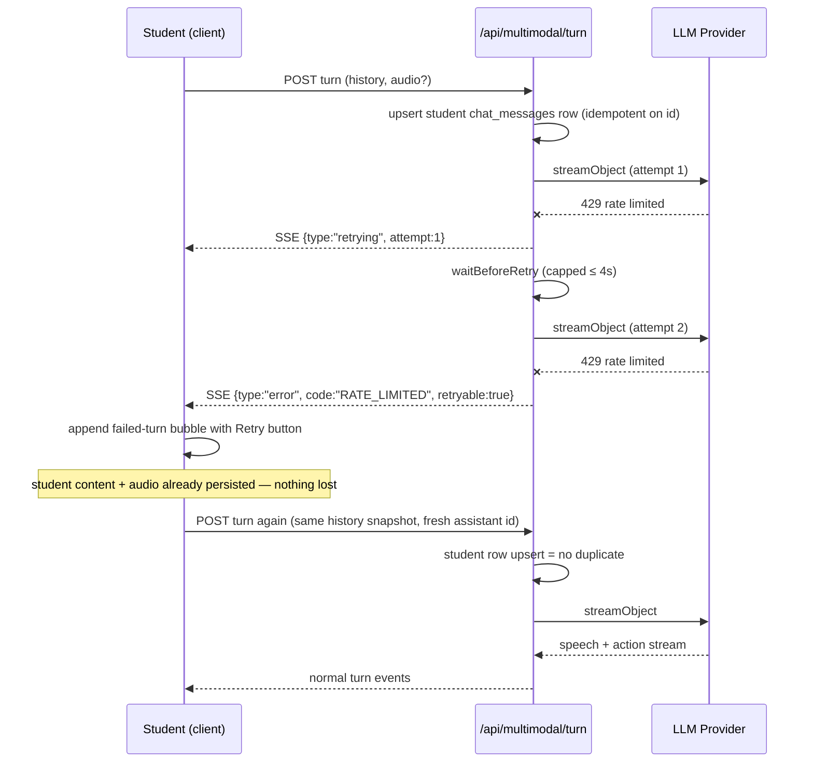
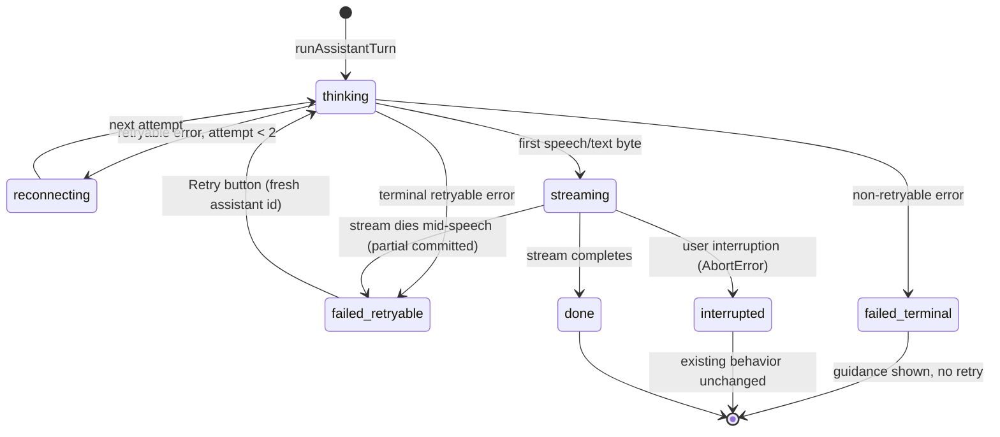
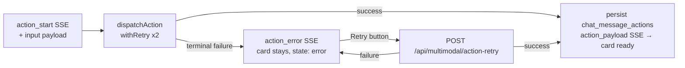

# AI Retry & Failure-Recovery Plan

Make every AI invocation failure recoverable in place: short silent server retries, then a user-facing **Retry** button — in the multimodal chat, action cards, and the evaluation/feedback flow — with machine-readable error codes end to end and no user content ever lost. Every terminal failure is also written to an admin-visible `app_logs` table (§8) so super admins and institution admins can audit errors down to the activity level.

> **Scope note (2026-07-11):** the text-only chat feature (`ChatInputArea` + `/api/chat-assessment` + `chat-stream.ts`) was removed from the codebase entirely — the multimodal interface is the only conversational surface. This plan therefore covers multimodal, actions, and evaluate only.

Related docs: [multimodal-orchestration-plan.md](./multimodal-orchestration-plan.md) · [adding-multimodal-actions.md](./adding-multimodal-actions.md) · [multimodal-interaction-config-plan.md](./multimodal-interaction-config-plan.md)

---

## 1. Motivation

Today, AI invocation failures are terminal from the user's perspective. The user's content is already safe (see §2), but the only recovery path is "do it again from scratch."

| Flow | Current behavior on failure | User impact |
|---|---|---|
| **Multimodal turn** (`/api/multimodal/turn`) | Server silently retries up to 4× with backoff up to 30s each (only before first byte), then emits `{type:"error"}` SSE. Client shows a toast + alert banner (`MultimodalInputArea.tsx`). | Up to ~60s of dead air on a rate limit, then a dead end — the student must re-speak/re-send. |
| **Action generation** (Call 2: MCQ, suggested response, display content) | `generateObject` in `src/lib/multimodal/actions/*.ts` has **zero retry**. On `{type:"action_error"}` the client **silently removes the card**. | The tutor's spoken reference ("try this question…") dangles; the student never sees the activity and gets no signal anything failed. |
| **Evaluation / feedback** (`/api/evaluate`) | Synchronous request; on failure a blanket `500` + toast (`AssessmentShell.tsx`). No record in submission tables. | Student must fully resubmit, creating a brand-new attempt flow, with no explanation of what happened. |

## 2. Core Principles

1. **User content is never lost.** This is already true and must stay true:
   - Student `chat_messages` rows are inserted before / independent of the AI call (turn route inserts the student row before the stream starts in single-transcript mode; dual-STT/direct-audio has fallback inserts).
   - Utterance audio is salvaged in the client catch block via `persistUtteranceAudio`.
   - Input areas keep local answer state when evaluation throws.
2. **Every AI failure is recoverable in place.** Silent server retries are short (2 attempts for interactive flows); manual retries via a Retry button are unlimited.
3. **Errors carry machine-readable codes end to end** — through SSE events and JSON responses — so the client decides UI treatment from `code`/`retryable`, never by string-matching messages.
4. **Retry button by default.** Retryable and `UNKNOWN` errors show a Retry button; only positively-identified permanent failures (misconfiguration, capability mismatch, revoked access, bad request) show guidance instead.
5. **Failures are auditable by admins.** Every silent retry attempt is recorded in `app_logs` (§8) at `warn` level, and every terminal failure at `error` level, with institution/class/activity scoping — super admins see everything, institution admins see their institution. Log writes are fire-and-forget and must never affect the user-facing flow.

## 3. Error Taxonomy

New module `src/lib/ai/errors.ts` (composes with `src/lib/ai/retry.ts`, no semantic changes there beyond exporting `getRetryAfterMs`):

```ts
export type AiErrorCode =
  | "RATE_LIMITED"         // 429
  | "PROVIDER_UNAVAILABLE" // 503 / overloaded
  | "NETWORK"              // fetch TypeError, socket reset
  | "TIMEOUT"
  | "AI_NOT_CONFIGURED"    // existing AI_NOT_CONFIGURED_ERROR_CODE
  | "CAPABILITY_MISMATCH"  // existing MULTIMODAL_ERROR_CODES.AUDIO_INPUT_CAPABILITY_MISMATCH
  | "INTEGRITY_REVOKED"    // existing integrity access revoked code
  | "BAD_REQUEST"          // 400/422, schema-invalid input
  | "UNKNOWN";

export interface ClassifiedAiError {
  code: AiErrorCode;
  message: string;
  retryable: boolean;      // true for RATE_LIMITED, PROVIDER_UNAVAILABLE, NETWORK, TIMEOUT, UNKNOWN
  retryAfterMs?: number;   // from Retry-After header when present
}

export function classifyAiError(err: unknown): ClassifiedAiError;
export function isRetryableCode(code: AiErrorCode | undefined): boolean; // undefined/UNKNOWN ⇒ true
```

| Code | Source | Retryable | User copy (indicative) |
|---|---|---|---|
| `RATE_LIMITED` | HTTP 429 | ✅ | "The tutor is busy right now — try again in a moment." |
| `PROVIDER_UNAVAILABLE` | HTTP 503 | ✅ | "The AI service is temporarily unavailable." |
| `NETWORK` | fetch `TypeError` | ✅ | "Connection problem — check your network and retry." |
| `TIMEOUT` | abort/timeout signals | ✅ | "That took too long — please retry." |
| `UNKNOWN` | anything unclassified | ✅ | "Something went wrong — please retry." |
| `AI_NOT_CONFIGURED` | `AiNotConfiguredError` | ❌ | "AI isn't set up for this class — contact your teacher." |
| `CAPABILITY_MISMATCH` | audio-input capability re-check (409) | ❌ | "This model doesn't support audio input." |
| `INTEGRITY_REVOKED` | integrity access revoked (403) | ❌ | routes to `onIntegrityAccessRevoked` as today |
| `BAD_REQUEST` | 400/422 | ❌ | "Something about this request was invalid." |

Classification delegates to the existing `isRetryableProviderError` / `getRetryAfterMs` logic and recognizes the three existing ad-hoc error-code constants, so the client has a single decision function.

**Wire formats** (backward compatible — old clients ignore the extra fields):

- SSE: `{ type: "error", error: string, code: AiErrorCode, retryable: boolean, retryAfterMs?: number }`
- JSON: `{ error: string, code: AiErrorCode, retryable: boolean, retryAfterMs?: number }` — and `/api/evaluate` passes through honest HTTP statuses (429/503) instead of a blanket 500.

## 4. Retry Policy

**Server does at most 2 silent attempts for student-facing interactive flows; everything beyond that is a visible, user-controlled retry.**

- `src/lib/ai/retry.ts` gains `export const INTERACTIVE_MAX_ATTEMPTS = 2;` and an optional `maxDelayMs` parameter on `waitBeforeRetry` / `withRetry`. Interactive callers pass ~4000ms so a `Retry-After: 30` cannot hold an SSE stream hostage.
- Adopted by: `/api/multimodal/turn` attemptLoop, `evaluateSubmission` → `generateStructured({ maxRetries: INTERACTIVE_MAX_ATTEMPTS })`, and the action handlers (§6).
- `DEFAULT_MAX_ATTEMPTS = 4` stays for teacher/background flows (`/api/generate-dynamic-questions`, `/api/generate-rubric-and-answer`) — they aren't latency-critical and already have a Retry button (`AssignmentResponseCore.tsx`).
- New SSE event `{ type: "retrying", attempt: number }` emitted from the attempt loops so `BotStatusPanel` can show "Reconnecting…" instead of silent dead air during the backoff.



## 5. Multimodal Turn Manual Retry

Turn lifecycle with the new failure states:



### Retry context

`MultimodalInputArea.tsx` keeps a ref (not React message state — audio base64 is large):

```ts
failedTurnRef: { history: ChatMessage[]; opts?: RunTurnOpts; error: ClassifiedAiError } | null
```

The non-abort branch of the `runAssistantTurn` catch block snapshots exactly the `(history, opts)` arguments it was called with, plus the classified error.

### Failed-turn bubble (replaces the banner for AI-turn failures)

- Append `{ id, role: "assistant", content: "", error: { code, message, retryable } }` to `messages` — new optional `error` field on the client `ChatMessage` interface.
- Rendered by `ContentBox` via a new `ChatTurnErrorBubble` composer (§9): retryable → message + Retry button; non-retryable → guidance text, no button.
- The `setError` banner and toast remain only for pre-turn failures (mic/transcription) and non-retryable errors.

### Retry handler

1. Remove the error bubble.
2. `void runAssistantTurn(failedTurnRef.history, failedTurnRef.opts)` — with `opts` adjusted per the audio decision table below.
3. `assistantMessageId` is minted fresh **inside** `runAssistantTurn`, so each retry gets a new assistant bubble id — never reuse the failed attempt's id (avoids FK/audio collisions).
4. Button disabled while `isAssistantTurnActive`; show attempt count ("Retry (2)"). No hard cap on manual retries; when `retryAfterMs` is present the button shows a countdown first.

### Audio vs transcript on retry

| State at failure | Retry sends |
|---|---|
| `user_transcript` already resolved (bubble no longer `status:"transcribing"`) | Plain-text history built from current `messagesRef` (matched by id); **drop** `latestUserAudio` — cheaper and deterministic. |
| Never resolved (direct-audio / dual-STT died early) | The stored `latestUserAudio` / original `transcriptCandidates` from `failedTurnRef` so the model re-resolves properly. |

### Duplicate student row avoidance

`insertChatMessage` (`src/lib/queries/chatMessages.ts`) becomes `.upsert(payload, { onConflict: "id" })`. Client-minted UUIDs make retries naturally idempotent, and update-on-conflict lets a retried dual-STT turn overwrite the fallback primary-candidate text with the properly resolved transcript. No schema migration. (Verify RLS permits students updating their own rows.)

### Partial-delivery failures (speech streamed, then died)

**Commit-partial + continue-as-new-turn — never regenerate.** The partial assistant text is already committed client-side (`commitAssistantTurnToMessages`) and persisted server-side ("persist even on interruption"). Deleting/superseding it would require DB mutations and audio cleanup. Instead:

- Detect via `assistantText.length > 0` in the catch.
- The retry sends history **including** the partial assistant bubble, plus a hidden context note (same mechanism as existing MCQ hidden notes): *"[Your previous reply was cut off by a technical error mid-sentence. Continue the conversation naturally; briefly restate anything essential.]"*
- The failed-turn bubble renders **after** the committed partial bubble.

This matches the app's existing interruption semantics exactly.

## 6. Action (Call 2) Retry



1. **Server-side silent retry at the dispatcher level:** wrap the handler call inside `dispatchAction` (`src/lib/multimodal/actions/dispatcher.ts`) with `withRetry(fn, INTERACTIVE_MAX_ATTEMPTS)` — one wrap covers every action kind, and **future kinds inherit silent retries automatically** with no per-handler step. This is safe because action persistence becomes upsert-on-id (point 4), so re-running a handler is idempotent; the accepted cost is that a failure *after* generation (e.g., a DB blip during persist) regenerates content on the retry. Individual handlers must **not** add their own `withRetry` (no nested retries). Actions run in parallel with TTS, so one retry is nearly free — speech masks the latency.
2. **Stop silently removing the card.** On `action_error` the client sets the card to `state: "error"` (already in the `PendingAction` type, `actionTypes.ts`) with the classified error, instead of filtering it out. `ActionCard.tsx` gains an error branch using the shared retry UI.
3. **Context transport:** the `action_start` SSE event gains `input: ActionInput` (the `resolvedAction` already in scope in the turn route). Client stores it as `PendingAction.input`. The payload is tiny (topic/difficulty/guidance) — no new persistence needed.
4. **New endpoint `POST /api/multimodal/action-retry`:**
   - Body: `{ assignmentId, submissionId, questionOrder, actionId, input, chatMessageId, language, supportLanguage? }`.
   - Plain JSON response — `generateObject` is non-streaming, nothing to stream.
   - Server: auth + integrity check mirroring the turn route; resolve the action's model via `getActionDefinition(kind).appFunctionKey` + `getCachedResolveModelConfig` — extract a shared `resolveActionModel()` helper deduping the turn route's inline version; rebuild recent conversation server-side from `chat_messages` (do **not** trust client-sent history); call `dispatchAction` with a collector `enqueue`; return `{ payload }` or classified error JSON.
   - Reuse the same `actionId`: `insertChatMessageAction` also becomes upsert-on-id (covers "persist succeeded but response lost" double-retry).
5. Client retry: card back to `state:"loading"` → POST → `state:"ready"` + payload on success, back to `state:"error"` on failure. Retry disabled while loading.

Keeping the card in error state keeps the tutor's spoken reference to it coherent, and the retry needs no turn re-run.

## 7. Evaluation / Feedback Retry

- **Server** (`/api/evaluate` catch): classify → return `{ error, code, retryable, retryAfterMs }` with status pass-through for 429/503. `evaluateSubmission` calls `generateStructured` with `maxRetries: INTERACTIVE_MAX_ATTEMPTS`.
- **Client** (`AssessmentShell.tsx`): new state `evaluationFailure: { answerText, error: ClassifiedAiError } | null`, set in the `handleEvaluate` catch (**keep the re-throw** so input areas retain their answer-preservation behavior). Render the shared retry card (`variant="block"`) near the evaluating area: retryable → "Evaluation failed — your answer is safe. [Retry]" with optional Retry-After countdown; non-retryable → guidance. Retry re-calls `handleEvaluate` with the same answer. Clear on retry start and on any new submission; disable while `isEvaluating`. Suppress the duplicate error toast for retryable errors (the card replaces it).
- **Decision: no failed-attempt record in submission tables.** `ai_invocations` (status `failed`, `retry_of`/`retry_index` chain) is already the audit trail; a failed evaluation stays invisible to grading.
- **Idempotency is natural:** `attempt_number` is recomputed from the DB max per request, and no `submission_attempts` row is written on failure ⇒ a retry reuses the same number; `submission_transcripts` upserts on `(submission_id, question_order, attempt_number)` are idempotent. Verify a unique index exists on `submission_attempts(submission_question_id, attempt_number)` and treat a conflict as "already evaluated — refetch attempts."

## 8. Admin-Facing Error Logs (`app_logs` table)

A new **largely agnostic** logs table for auditing and visibility, read by the platform super admin (everything) and institution admins (their institution). It is not AI-specific — the retry work is simply its first producer. It complements, not replaces, `ai_invocations`:

| | `ai_invocations` | `app_logs` |
|---|---|---|
| Purpose | Deep AI audit (request/response JSON in GCS, tokens, retry chain) | Lightweight, human-scannable event/error feed |
| Scope | AI calls only | Any server-side event worth surfacing to admins |
| Readers | Service role only (RLS enabled, no policies) | Super admin + institution admins via RLS |
| Granularity | Per AI call | Per event, scoped down to activity/question level |

### Schema (new migration)

```sql
create table public.app_logs (
  id               uuid primary key default gen_random_uuid(),
  created_at       timestamptz not null default now(),
  level            text not null check (level in ('info', 'warn', 'error')),
  source           text not null,   -- e.g. 'multimodal_turn' | 'multimodal_action' | 'action_retry' | 'evaluate'
  event            text not null,   -- e.g. 'ai_failure' | 'silent_retries_exhausted' | 'manual_retry'
  error_code       text,            -- AiErrorCode when applicable (§3)
  message          text,
  -- scoping chain (all nullable — the table stays agnostic):
  institution_id   uuid references public.institutions(id) on delete cascade,
  class_id         uuid references public.classes(id) on delete set null,
  activity_type    text,            -- 'assignment' | 'quiz' | 'survey' | 'learning_content'
  activity_id      text,            -- matches ai_invocations.assignment_id (text ids)
  submission_id    text,
  question_order   integer,
  user_id          uuid,            -- affected user (student/teacher), when known
  ai_invocation_id uuid references public.ai_invocations(id) on delete set null,
  metadata         jsonb not null default '{}'::jsonb
);

create index app_logs_institution_created_idx on public.app_logs (institution_id, created_at desc);
create index app_logs_class_created_idx on public.app_logs (class_id, created_at desc) where class_id is not null;
create index app_logs_level_created_idx on public.app_logs (level, created_at desc);
```

- `institution_id` is **denormalized at write time** (derived from the class) so RLS never needs a join; classes don't move between institutions, so it can't go stale.
- `source`/`event` are free-text (conventions, not enums) so future non-AI producers need no migration — that's the "largely agnostic" requirement.
- `ai_invocation_id` links an error row to the deep audit trail when the event came from an AI call.

### RLS

- **SELECT:** `is_platform_super_admin()` sees all rows; `is_institution_admin(institution_id)` sees rows for their institution (rows with `institution_id is null` are super-admin-only).
- **INSERT/UPDATE/DELETE:** no policies for `authenticated` — all writes go through the **service-role client from server code only**, mirroring `ai_invocations`.

### Write helper

`src/lib/logging/appLog.ts` (server-only), modeled on `recordInvocation.ts`'s error-swallowing style:

```ts
export function logAppEvent(input: {
  level: "info" | "warn" | "error";
  source: string; event: string;
  errorCode?: AiErrorCode; message?: string;
  classId?: string; activityType?: string; activityId?: string;
  submissionId?: string; questionOrder?: number; userId?: string;
  aiInvocationId?: string; metadata?: Record<string, unknown>;
}): void; // fire-and-forget: resolves institution_id from classId, inserts via service role, catches + console.errors — NEVER throws or blocks the caller
```

### Producers added by this plan

**Terminal failures → `level: "error"`** (after silent retries are exhausted — one row per user-visible failure):

- `/api/multimodal/turn` — before emitting the terminal `{type:"error"}` SSE (`source: "multimodal_turn"`).
- `dispatchAction` catch (dispatcher-level, §6) — covers every current and future action kind (`source: "multimodal_action"`, `metadata.kind`).
- `/api/multimodal/action-retry` — failed manual action retries (`source: "action_retry"`).
- `/api/evaluate` catch (`source: "evaluate"`).

**Silent retry attempts → `level: "warn"`** (one row per retry, `event: "silent_retry"`, with `metadata.attempt` and the classified `error_code`): a provider blip that self-heals never reaches the user but should still be visible to admins as an early signal (rate-limit pressure, provider degradation). Rather than sprinkling log calls, `withRetry` in `src/lib/ai/retry.ts` and `generateStructured` in `src/lib/ai/structured.ts` (which runs its own attempt loop, not SDK-internal retries) gain an optional `onRetryAttempt(attempt, error)` callback (Phase 1, no logging dependency); Phase 2 has each caller pass a callback that forwards to `logAppEvent` with its scoping context. The turn route's attempt loop logs at the same point it emits the `{type:"retrying"}` SSE. These warn rows parallel the `ai_invocations` `retry_of`/`retry_index` chain but are admin-readable.

Optionally log `level: "info", event: "manual_retry"` when a user-initiated retry starts, so admins can see recovery rates, not just failures.

### Minimal admin viewer

- `/platform/logs` (super admin, all institutions) and a logs tab/page under `/admin/institutions/[id]` (institution admin) — a filterable table (level, source, date, class/activity) reading `app_logs` directly through RLS-scoped selects. Reuse existing admin table components; no new service endpoints needed.

## 9. Shared UI Building Blocks

Per the project convention (ui primitive + feature composer, no inlined one-off UI):

- **Primitive** `src/components/ui/retry-error-card.tsx` — purely presentational:
  ```ts
  { message: string; detail?: string; retryable: boolean; retryLabel?: string;
    onRetry?: () => void; disabled?: boolean; countdownMs?: number;
    variant: "inline" | "block" }
  ```
  `inline` = compact bubble-sized row (multimodal chat); `block` = card (evaluate, action).
- **Hook** `src/lib/hooks/useRetryableRequest.ts` — thin standardization of `{ failure: ClassifiedAiError | null, fail(err), clear(), retry(), attemptCount }` around a wrapped async fn's last args. It deliberately does **not** own `runAssistantTurn`'s streaming lifecycle — that stays in the feature components. Over-abstracting the turn loop is the main scope risk of this project.
- **Composers:** `src/components/Shared/KonvoVoice/ChatTurnErrorBubble.tsx` (used by `ContentBox`), the error branch inside `ActionCard.tsx`, and direct `RetryErrorCard variant="block"` usage in `AssessmentShell`.

## 10. Decisions Made

| Question | Decision | Rationale |
|---|---|---|
| Silent server attempts | 2 for interactive flows (`INTERACTIVE_MAX_ATTEMPTS`), 4 stays for teacher/background | Covers transient blips (~1-4s); beyond that the user should be in control, not staring at "thinking" for 60s |
| Partial-delivery semantics | Commit partial + continue-as-new-turn with hidden note | Partial already persisted client- and server-side; regeneration would need DB/audio cleanup and risks double speech |
| Student-row dedup | PK upsert on client-minted id in `insertChatMessage` | Zero schema change; also lets a retried dual-STT turn correct the fallback transcript |
| Action silent-retry placement | One `withRetry` around the handler call in `dispatchAction`, not per-handler | Future action kinds inherit retries automatically; upsert-on-id makes handler re-runs idempotent |
| Action context transport | `action_start` SSE carries `input`; kept in client state | Payload is tiny; avoids new persistence entirely |
| Action retry transport | Dedicated JSON endpoint, not SSE | `generateObject` is non-streaming — nothing to stream |
| Failed-evaluation persistence | None in submission tables | `ai_invocations` already audits failures; grading should never see failed attempts |
| Failed-turn persistence | None | Fully derivable from message order (trailing student row without assistant reply); see Future Work |
| Retry-button policy | Retryable + `UNKNOWN` → button; enumerated permanent codes → guidance | Retry is the safe default; only provably permanent failures suppress it |
| Audio vs transcript on retry | Transcript if resolved, stored audio/candidates if not | Cheaper + deterministic when possible; preserves dual-STT resolution when needed |
| Banner vs bubble | Bubble for AI-turn failures; banner/toast only pre-turn + non-retryable | Failure belongs in the conversation where the retry action lives |
| Admin error visibility | New agnostic `app_logs` table, not a reuse of `ai_invocations` | `ai_invocations` is AI-specific, service-role-only, and heavy (GCS payloads); admins need a lightweight RLS-readable feed that non-AI producers can also use |
| Log write path | Fire-and-forget `logAppEvent()` via service role; `error` row per terminal failure + `warn` row per silent retry attempt | Logging must never slow or break a user flow; warn rows give admins early signal on self-healing blips (rate-limit pressure, provider degradation) before anything becomes user-visible |
| Log read access | RLS: super admin all rows; institution admin rows matching `is_institution_admin(institution_id)`; `institution_id` denormalized at write time | No joins in RLS; classes never change institutions so the denormalization can't go stale |

## 11. Risks & Edge Cases

- **Interrupted SSE mid-speech:** partial assistant text is committed + persisted; retry is a *continuation* turn — never delete/regenerate the partial. The error bubble must render after the committed partial bubble.
- **Duplicate student rows:** today's plain insert on retry throws a duplicate-key error that is merely `console.error`'d; the upsert makes idempotency deliberate. Verify RLS allows upsert-update on own rows.
- **TTS session lifecycle:** each POST opens a fresh Cartesia/Sarvam WS — no reuse across retries. The client already releases turn UI + playback in the catch path; retry calls `playback.beginTurn` fresh. Stale audio-pump events from the failed turn are no-ops thanks to the existing `assistantTurnSeqRef` turn-id guards.
- **AbortController interplay:** a user *interruption* (AbortError) must **not** produce a retry bubble — the existing early-return abort branch stays untouched. Disable the Retry button until the previous turn's `finally` has run (`isAssistantTurnActive === false`).
- **Dual-STT retry semantics:** after failure the pending bubble is salvaged to the primary candidate and its audio persisted. Retry with the original `transcriptCandidates` (kept in `failedTurnRef`) lets the model re-resolve; the upsert then corrects the persisted row. Do **not** re-upload the audio.
- **Direct-audio deferred-audio map:** if `user_transcript` never arrived, the retry must re-send the stored base64 audio — verify the empty-content branch of the catch leaves the deferred-audio map entry intact (or re-add it from `failedTurnRef`).
- **Evaluate concurrent double-submit:** two tabs / double click can compute the same `attempt_number`; confirm the unique index and treat conflict as "already evaluated — refetch."
- **Dispatcher-level retry re-runs the whole handler:** if generation succeeded but persistence failed, the retry regenerates content (small cost, accepted); the `chat_message_actions` upsert-on-id and the single `action_payload` enqueue-on-success keep the re-run side-effect-safe. Handlers must stay "generate → persist → enqueue" with no partial enqueues before success.
- **Action retry racing a new turn:** the action retry is independent (own endpoint, own card) so a new turn starting mid-retry is safe; just disable the card's retry while loading.
- **Retry-After honesty:** for a 429 with a long `Retry-After`, show a countdown on the button rather than letting users hammer retries.
- **SSE event ordering:** the turn route emits `{error}` then `{done}`; the client throws on `error` so later events go unread — fine, but the failed-bubble append must happen exactly once (the catch is the single site).
- **Log writes in failure paths:** `logAppEvent` runs inside catch blocks that are already handling an error — it must swallow its own failures (`console.error` only) so a logging outage can never mask or amplify the original error, and it must not `await`-block the SSE error emit.
- **`app_logs` volume/retention:** manual retries are unlimited and every silent retry now writes a `warn` row, so a flapping provider or a sustained rate-limit episode can generate many rows — this is the point (admins see the pressure building), but it makes retention matter more. Indexes above keep reads cheap; a retention/cleanup policy (e.g., cron delete of `info`/`warn` rows > 90 days, `error` rows kept longer) is deferred to Future Work.

## 12. Implementation Phases

### Phase 1 — Error taxonomy + retry policy (server-only, no UI change)
- [ ] Create `src/lib/ai/errors.ts` (`AiErrorCode`, `ClassifiedAiError`, `classifyAiError`, `isRetryableCode`); export `getRetryAfterMs` from `src/lib/ai/retry.ts`.
- [ ] `src/lib/ai/retry.ts`: add `INTERACTIVE_MAX_ATTEMPTS = 2`; optional `maxDelayMs` on `waitBeforeRetry` / `withRetry`; optional `onRetryAttempt(attempt, error)` callback on `withRetry` and on `generateStructured`'s attempt loop (`structured.ts`) — wired to logging in Phase 2.
- [ ] `src/app/api/multimodal/turn/route.ts`: attemptLoop uses `INTERACTIVE_MAX_ATTEMPTS` + capped delay; error SSE gains `code`/`retryable`/`retryAfterMs`; emit `{type:"retrying", attempt}`.
- [ ] `src/app/api/evaluate/route.ts`: catch classifies and returns `{error, code, retryable, retryAfterMs}` with pass-through 429/503 status; `generateStructured` called with `maxRetries: INTERACTIVE_MAX_ATTEMPTS`.

### Phase 2 — Admin logs table (`app_logs`)
- [ ] New migration: `app_logs` table + indexes + RLS (super admin SELECT all; institution admin SELECT own institution; no authenticated write policies).
- [ ] `src/lib/logging/appLog.ts`: fire-and-forget `logAppEvent()` (service role, resolves `institution_id` from `class_id`, never throws).
- [ ] Producers — terminal failures (`error`): `/api/multimodal/turn`, `dispatchAction`, `/api/evaluate` (the `action-retry` producer lands with Phase 5); optional `manual_retry` info events from the retry endpoints.
- [ ] Producers — silent retries (`warn`, `event: "silent_retry"`): pass `onRetryAttempt` → `logAppEvent` in the turn route attempt loop (alongside the `retrying` SSE), the `dispatchAction` `withRetry` wrap, and evaluate's `generateStructured` call.
- [ ] Minimal viewer: `/platform/logs` page + institution logs page under `/admin/institutions/[id]` (filterable table over RLS-scoped selects).

### Phase 3 — Shared UI primitives
- [ ] `src/components/ui/retry-error-card.tsx` (inline + block variants, optional Retry-After countdown).
- [ ] `src/lib/hooks/useRetryableRequest.ts`.
- [ ] `src/components/Shared/KonvoVoice/ChatTurnErrorBubble.tsx`; extend client `ChatMessage` types (MultimodalInputArea, ContentBox props) with `error?: { code, message, retryable }`; `ContentBox.tsx` renders the bubble.

### Phase 4 — Multimodal turn retry
- [ ] `src/lib/queries/chatMessages.ts`: `insertChatMessage` → upsert on `id`.
- [ ] `MultimodalInputArea.tsx`: `failedTurnRef` snapshot in the non-abort catch branch; append failed bubble instead of banner for AI-turn failures; retry handler (rebuild history from current `messagesRef` by id, drop `latestUserAudio` when transcript resolved, hidden continue-note when speech was partially streamed); parse `code`/`retryable` off the error SSE (update `parseMultimodalTurnStream` types); handle `retrying` → `BotStatusPanel` "Reconnecting…".

### Phase 5 — Action retry
- [ ] `src/lib/multimodal/actions/dispatcher.ts`: wrap the handler call in `dispatchAction` with `withRetry(fn, INTERACTIVE_MAX_ATTEMPTS)` (kind-agnostic — covers current and future handlers; no per-handler retries).
- [ ] Turn route: `action_start` event carries `input`; extract shared `resolveActionModel()` helper.
- [ ] `src/lib/queries/chatMessageActions.ts`: upsert on id.
- [ ] New `src/app/api/multimodal/action-retry/route.ts` (auth, integrity check, rebuild recent messages from DB, collector enqueue, JSON response).
- [ ] Client: keep card on `action_error` with `state:"error"` + stored `input` (`actionTypes.ts` gains `input?: ActionInput`); `ActionCard.tsx` error branch with retry → POST → loading → ready/error.

### Phase 6 — Evaluate retry UI
- [ ] `AssessmentShell.tsx`: `evaluationFailure` state set in `handleEvaluate` catch (keep re-throw); render block `RetryErrorCard`; retry re-calls `handleEvaluate` with the same answer; clear on new submit/content change; suppress duplicate toast for retryable errors.

### Phase 7 — Docs + verification
- [ ] Run the verification pass (§13); cross-link this doc from `adding-multimodal-actions.md` (the `action_error` contract changes).

## 13. Verification

1. **Static:** `npx tsc --noEmit`, lint, build.
2. **Fault injection (dev-only):** temporarily throw a synthetic 429 (`{statusCode: 429, responseHeaders: {"retry-after": "2"}}`) from `createMultimodalTurnStream` / the MCQ handler / `generateStructured` for the first N calls. Verify: exactly 2 attempts in the `ai_invocations` retry chain (`retry_of`/`retry_index`), error SSE with `code: "RATE_LIMITED"`, failed bubble with working Retry, a single student `chat_messages` row (upsert), fresh assistant id per retry.
3. **Partial-stream failure:** throw after ~50 speech chars streamed → partial bubble commits + persists; retry continues with the hidden note; no duplicate assistant rows.
4. **Direct-audio + dual-STT:** fail before `user_transcript` → pending bubble survives, retry re-sends audio/candidates, transcript resolves, audio uploads exactly once.
5. **Action retry:** fail MCQ generation terminally → card shows error + Retry; retry endpoint returns payload; one `chat_message_actions` row for the id; answering works on the retried card.
6. **Evaluate:** fail evaluation → no `submission_attempts` row, answer intact in every input mode (static/voice/multimodal), retry card appears, retry produces the expected `attempt_number`, feedback renders.
7. **Non-retryable paths:** `AI_NOT_CONFIGURED` (503 + code) and capability mismatch (409) show guidance without a Retry button; integrity revocation still routes to `onIntegrityAccessRevoked`.
8. **Regression:** typed interruption mid-speech still commits the partial with its replay button and does **not** show a retry bubble.
9. **Admin logs:** every fault-injected terminal failure above produces exactly one `app_logs` error row with correct `institution_id`/`class_id`/`activity_id`/`error_code` and a working `ai_invocation_id` link, preceded by one `warn` `silent_retry` row per retry attempt (`metadata.attempt` matching the `ai_invocations` `retry_index` chain); a silent retry that eventually succeeds leaves only its warn rows, no error row. As super admin, `/platform/logs` shows rows from two institutions; as an institution admin, only own-institution rows are visible (RLS) and rows with `institution_id is null` are hidden. A simulated `app_logs` insert failure (e.g., bad service key in dev) leaves the user-facing error/retry flow fully intact.

## 14. Future Work

- **Page-refresh recovery:** once chat session rehydration exists, derive a "retry" offer on reload from a trailing `role='student'` row with no later assistant row for that attempt — no schema change needed. Out of scope now because `MultimodalInputArea` never rehydrates `messages` from `chat_messages` on mount.
- **Model-native retriable actions:** let the orchestrator re-issue a failed action in its next turn instead of (or in addition to) the manual card retry.
- **`app_logs` growth:** retention/cleanup policy (scheduled deletion of old `info`/`warn` rows, longer keep for `error`), broader non-AI producers (auth anomalies, file-upload failures, integrity events), and richer viewer features (search, CSV export, per-class drill-down from the class pages).
