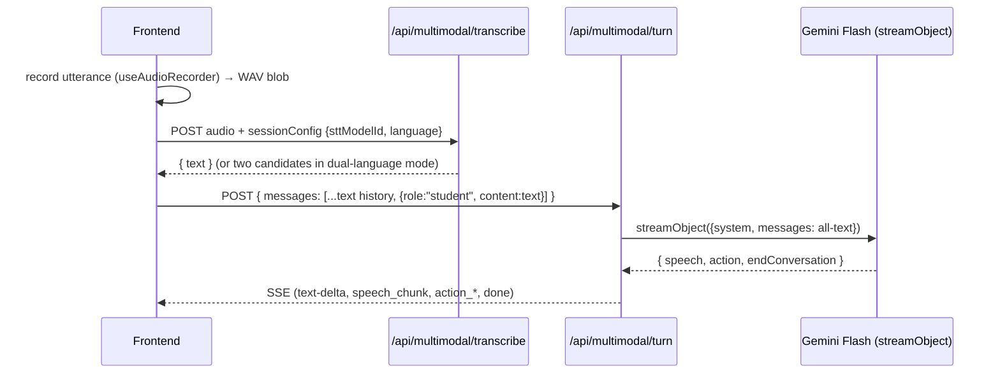
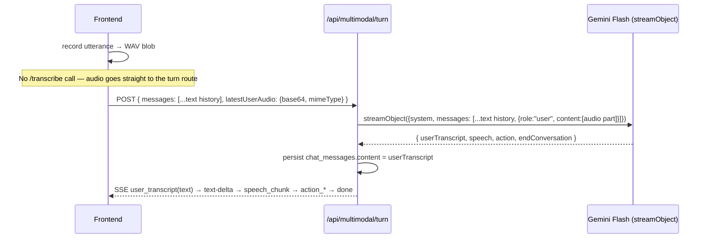

# Multimodal Interaction Configuration Plan

A per-assignment config for how the learner and tutor exchange audio in `MultimodalInputArea`:
whether the learner's speech reaches the model directly (bypassing STT) or via transcription,
and whether the tutor's replies are spoken automatically, only on request, or never. Both
axes turned out to be two fields of the same config object, so this supersedes the earlier
audio-only draft (`direct-audio-input-plan.md`, folded in here).

---

## 1. Motivation

Two independent product asks, one config surface:

1. **Input**: models with native audio understanding (Gemini today) can take the learner's
   raw utterance directly — skip the `/api/multimodal/transcribe` round trip, let the model
   hear prosody/tone directly, save a network hop per turn.
2. **Output**: TTS doesn't have to run on every turn. A teacher may want text-only replies by
   default with speech available on click (cheaper, faster, less intrusive for text-heavy
   activities), or no speech capability at all.

Both are properties of "how does this activity's I/O work," not mid-conversation behaviors
like MCQ/language-support (`botPromptConfig.multimodal_actions`) — hence a new, separate
config object rather than growing `multimodal_actions` further.

---

## 2. The config interface

```ts
interface MultimodalInteractionConfig {
  input: {
    /** Learner-facing input methods. "audio" is the only one MultimodalInputArea supports
     * today; "text" is listed for when a hybrid input area exists. */
    modes: ("text" | "audio")[];
    /** Only meaningful when "audio" ∈ modes. Defaults to "transcribe" (today's only behavior). */
    audioDelivery?: "transcribe" | "direct";
  };
  output: {
    /** Governs whether/when the tutor's reply is synthesized to speech. */
    speechMode: "automatic" | "on_demand" | "none";
    /**
     * Reserved, not implemented by this plan. Who produces the audio signal:
     * a separate TTS provider (today's only option) vs. the chat model itself
     * emitting audio natively, skipping the TTS step entirely. See §5.
     */
    audioSource?: "tts_provider" | "model_native";
  };
}
```

Lives alongside `multimodal_actions` on `botPromptConfig`
(`src/components/Shared/AssessmentInputs/MultimodalInputArea.tsx:225-230` shows the existing
sibling, `languageSupport`) — same persistence path documented in
`prompt-construction-flow.md` Diagram A: `AssignmentForm.tsx` → `assignments.bot_prompt_config`
→ read directly by `MultimodalInputArea` (this is a client behavior switch, not prompt text,
so it doesn't go through `useInterpolatedPrompts`).

`input.modes` including both `"text"` and `"audio"` is out of scope for this plan —
`MultimodalInputArea` is audio-only today; a hybrid text/audio input area is a separate,
larger UI change. This plan only implements `input.audioDelivery` and `output.speechMode`.

---

## 3. Input: `audioDelivery`

### 3a. Current flow (`"transcribe"`, today's only behavior)



Every turn pays for a full STT request (`src/app/api/multimodal/transcribe/route.ts`) before
the LLM ever sees the utterance. In dual-language mode this is _two_ STT calls run in
parallel (`sessionConfig.supportLanguage`), and the LLM is handed both readings and asked to
pick the coherent one via a `userTranscript` schema field
(`src/lib/ai/chat-stream-object.ts:52-77`, `dualTranscript` option) — see
`resolveMultimodalTurnCall` and the `DUAL TRANSCRIPT` directive in
`src/lib/ai/multimodal-directives.ts:180-189`. That mechanism — model receives raw signal,
resolves it to clean text, which becomes the persisted/canonical transcript — is the direct
precedent for `"direct"` delivery below.

### 3b. Proposed flow (`"direct"`)



**Only the newest turn's request ever carries audio.** Every prior turn in `messages`
already carries only `content` (text) — persisted from a previous turn's resolved
`userTranscript` — exactly as dual-transcript mode works today (`chat-stream-object.ts`
builds `sdkMessages` from `ChatMessage.content` strings; `MultimodalInputArea.tsx`'s
`user_transcript` handler already rewrites the pending bubble's `content` from candidates to
the model's chosen text). So "don't keep the audio in the whole prompt" is **already the
shape of the existing architecture** — nothing new has to be built for it, it falls out of
extending the current `userTranscript` field to a new source. The risk is not accidentally
_breaking_ that invariant when wiring in the new path (e.g. by storing `latestUserAudio` on
the `ChatMessage` and resending it every turn instead of only attaching it to the one fresh
request).

### 3c. Schema change: generalize `userTranscript`

`buildTurnSchema` (`chat-stream-object.ts:52-77`) currently takes a single `dualTranscript`
boolean. Generalize the trigger to any case where the model must resolve raw input into a
canonical transcript:

```ts
type TranscriptResolutionMode = "dual_stt" | "direct_audio";

export function buildTurnSchema(
  availableActions: ActionKind[],
  transcriptResolution?: TranscriptResolutionMode,
) {
  const base = { speech: speechField, action: ..., endConversation: ... };
  if (!transcriptResolution) return z.object(base);

  const userTranscriptField =
    transcriptResolution === "dual_stt"
      ? z.string().describe(/* existing dual-STT wording, unchanged */)
      : z.string().describe(
          "Transcribe exactly what the learner said in the audio, in the language they " +
          "actually spoke. If the audio is silent, unintelligible, or contains no speech, " +
          "set this to an empty string.",
        );

  return z.object({ userTranscript: userTranscriptField, ...base });
}
```

Same treatment for the `DUAL TRANSCRIPT` directive vs. a new `DIRECT AUDIO` directive in
`multimodal-directives.ts` — one new branch, same `userTranscript`-emission plumbing in
`turn/route.ts` (the `lastPartialUserTranscript` / `userTranscriptEmitted` tracking at
`route.ts:353-360` and `575-676` needs no structural change, just a second condition that
triggers it — currently gated on `dualTranscriptDescriptor`, generalize to
`transcriptResolutionMode`).

**Silence/no-speech handling** — today `/transcribe` returns HTTP 422 "No speech detected"
and the client shows a toast without ever calling the turn route
(`MultimodalInputArea.tsx:1356-1363`). With `"direct"` delivery there is no pre-flight check;
the model itself must report empty `userTranscript` for silence, and the client needs a new
branch: if `user_transcript` arrives empty, discard the pending bubble and show the same
"No speech detected" toast instead of committing an empty turn.

### 3d. Request contract change

`/api/multimodal/turn` gains one optional field on the request body (JSON, not multipart —
audio clips are short utterances, base64 overhead is acceptable and keeps one content-type
for the whole route):

```ts
interface MultimodalTurnRequestBody {
  // ...existing fields
  latestUserAudio?: {
    base64: string;
    // The recorder's real MIME type, codec parameters included (e.g.
    // "audio/webm;codecs=opus"), NOT a WAV conversion — see the codec spike
    // below. Passed straight through as-is by the server.
    mimeType: string;
  };
}
```

Server builds the last SDK message as a multi-part `UserContent` when present:

```ts
{
  role: "user",
  content: [
    { type: "file", data: body.latestUserAudio.base64, mediaType: body.latestUserAudio.mimeType },
  ],
}
```

(`ai@6`'s `FilePart`/`UserContent` types support this today; Google's provider maps inline
`file` parts with an `audio/*` media type to Gemini's audio-understanding input — confirmed
against `node_modules/@ai-sdk/google` and `node_modules/ai/dist/index.d.mts`, no SDK upgrade
needed.)

**Codec spike (post-implementation follow-up).** The first implementation converted the
recording to WAV via `tryConvertToWavBlob` before sending, matching the STT-provider convention
`/transcribe` already uses. A follow-up spike tested whether that conversion is actually
necessary: it sends the *native* recorder output — `audio/webm;codecs=opus` and
`audio/ogg;codecs=opus` (Chrome/Firefox's `MediaRecorder` defaults, codec parameters included,
exactly as `recorder.mimeType` reports them) and `audio/mp4`/`audio/aac` (Safari's default) —
straight to `gemini-3-flash-preview` via the same schema. **All formats succeeded with 100%
verbatim transcript accuracy**, at roughly **6-9% of uncompressed-WAV's payload size** (WAV:
391 KB for a ~13s test utterance; webm/opus: 26.8 KB; ogg/opus: 24.5 KB; mp4/aac: 36 KB) — far
better than downsampling WAV alone would have achieved (~67% of baseline). This directly
contradicts the ambiguous/conflicting format-support signal in Gemini's public docs (§3g had
flagged Opus-in-Ogg as a documented risk based on a third-party bug report) — empirically, this
model accepts the browser's actual native output without any conversion. **Decision: skip the
WAV conversion for this path entirely and send `recorded` (the native `MediaRecorder` blob) with
its own real `.type` as `mimeType`.** WAV downsampling (the original, more conservative
recommendation) is superseded — sending the native codec already gets a much bigger size
reduction for free, with no new client-side encoding step. The archival/utterance-audio
persistence pipeline (`persistUtteranceAudio`, `/api/multimodal/audio/utterance`) is
intentionally left untouched — it still converts to WAV for storage, which is an unrelated,
already-working feature (hardcoded `.wav` extension/content-type) out of scope for this
optimization.

`latestUserAudio` and `latestTranscriptCandidates` (dual-STT) are mutually exclusive —
`"direct"` delivery replaces dual-STT entirely (§3f). `messages` still carries the pending
student bubble's `id` so the FK-ordering invariant for utterance-audio upload
(`route.ts:328-347`, `MultimodalInputArea.tsx`'s `deferredStudentAudioRef`) is unchanged: the
client still defers `persistUtteranceAudio` until `user_transcript` arrives, same as
dual-transcript mode does today.

### 3e. Client change

In `handleMicPress` (`MultimodalInputArea.tsx:1267-1427`), when `audioDelivery === "direct"`:

- Skip the `fetch("/api/multimodal/transcribe", ...)` block entirely.
- Still show a pending bubble (`status: "transcribing"`, content e.g. "Processing...") — same
  UX shape as today, just resolved by `user_transcript` SSE instead of the transcribe
  response.
- Base64-encode the **native recorded blob** (not a WAV conversion — see the codec spike
  above) and pass it, with its real `.type` as `mimeType`, as `latestUserAudio` in the
  `runAssistantTurn` → `/api/multimodal/turn` POST body.
- Separately, still run `tryConvertToWavBlob` for archival purposes only, and defer that WAV
  blob into `deferredStudentAudioRef` for `persistUtteranceAudio`, same as today — the two
  conversions serve different destinations now (native → model, WAV → archive).

No change to `useAudioRecorder` or the utterance-audio upload path/format.

### 3f. Interaction with dual-language support

Dual-language STT (`sessionConfig.supportLanguage`, two parallel STT calls,
`latestTranscriptCandidates`) exists to let the model disambiguate which language the learner
actually spoke, when STT is a black box producing two guesses. `"direct"` delivery removes
the need for that guess-and-pick dance — the model hears the actual audio and can identify
the spoken language itself. So when `audioDelivery === "direct"`:

- The two-candidate STT flow is skipped entirely (no `sessionConfig.supportLanguage` parallel
  calls).
- The system prompt's language-support directive still tells the model both languages are in
  play (existing `languageHelpAvailable` mechanism, unchanged) — it just no longer needs the
  `DUAL TRANSCRIPT` framing, since there's only one source (the audio) to interpret, not two
  conflicting STT readings to arbitrate between.
- `transcriptResolutionMode` is `"direct_audio"` rather than `"dual_stt"` any time
  `supportLanguage` is active _and_ `audioDelivery === "direct"` — §3c's schema change
  already covers the wording split.

### 3g. Capability gating

No foundation model in `CATALOG_MODELS` (`src/lib/ai/catalog/data.ts`) currently declares
audio input for `text_generation` — `gemini-3-flash-preview` is `io.inputs: ["text"]`
today, and `gemini-live-preview` (`io.inputs: ["text","audio"]`) is a _separate_ realtime/Live
API surface (`apiSurface: "live"`, task `realtime_dialogue"`), not the `chat_completions`
surface `text.chat_tutoring` resolves against. Gemini's regular `generateContent`/
`streamObject` surface also accepts inline audio for models like `gemini-3-flash-preview` —
that's a distinct capability from the Live API and needs its own tag.

- Add a new `ModelTask`: `"audio_input"` (`src/lib/ai/catalog/types.ts:5-9`).
- Tag it on `gemini-3-flash-preview` (and any future model verified to accept inline audio
  parts on the same surface used for `text.chat_tutoring`).
- Add a resolver mirroring `resolveAvailableActionKindsForClass` (`multimodal-orchestration-
plan.md` §"Capability gating"): resolve `text.chat_tutoring`'s bound model for the class,
  check `modelSupportsTasks(model, ["audio_input"])` (`src/lib/ai/catalog/helpers.ts:414-418`).
- Expose it via `GET /api/multimodal/interaction-support?classDbId=` (§6) so the teacher
  toggle disables itself with an explanatory tooltip when the class's configured chat model
  doesn't support it — same UX pattern already established for action toggles.

### 3h. Server-side re-validation — hard error, not fallback

Gating is **authoring-time only** (§3g's toggle + endpoint). No request-time STT fallback —
that was considered and dropped as unnecessary complexity for a case that should be rare
(requires an admin to change the class's bound model out from under an already-configured
assignment). Instead: `turn/route.ts` re-checks `modelSupportsTasks(config, ["audio_input"])`
against the _actually-resolved_ model right after its existing `getCachedResolveModelConfig`
call (`route.ts:226-243` — a one-line addition, no new resolution call needed) before
honoring `latestUserAudio`. On mismatch, reject the request outright with a dedicated error
code (§3i) rather than silently degrading or guessing at a fallback; the client surfaces a
"contact your administrator" message, same shape as the existing `AI_NOT_CONFIGURED` 503
handling in `runAssistantTurn`'s catch block (`MultimodalInputArea.tsx`).

### 3i. Error code dictionary

Today, client-checkable error codes are ad hoc — each domain defines its own single constant
in its own file (`AI_NOT_CONFIGURED_ERROR_CODE` in `src/lib/ai/credentials/constants.ts`,
`INTEGRITY_ACCESS_REVOKED_ERROR_CODE` in `src/lib/integrity/constants.ts`), each checked via
`response.status === N && errorData.code === X` at the one call site that cares
(`MultimodalInputArea.tsx`'s `runAssistantTurn`). That's fine at two codes; it stops being
"easily referable" as more multimodal-specific error cases accumulate (capability mismatches,
future audio-output errors, etc.).

For this feature area, centralize instead of adding a third scattered file:

```ts
// src/lib/multimodal/errorCodes.ts

/**
 * Registry of client-checkable error codes returned by /api/multimodal/* routes.
 * Add new multimodal error cases here rather than inventing an ad hoc string at
 * the call site — keeps the client's error-branch list and the server's list of
 * possible codes in the same place.
 */
export const MULTIMODAL_ERROR_CODES = {
  AUDIO_INPUT_CAPABILITY_MISMATCH: "AUDIO_INPUT_CAPABILITY_MISMATCH",
} as const;

export type MultimodalErrorCode =
  (typeof MULTIMODAL_ERROR_CODES)[keyof typeof MULTIMODAL_ERROR_CODES];
```

`turn/route.ts` returns (status `409`, chosen over `400`/`422` since the request was
well-formed but conflicts with the class's current AI configuration):

```ts
return NextResponse.json(
  {
    error:
      "Error: 409. This activity's AI configuration no longer supports direct audio input to the model. Please contact your administrator.",
    code: MULTIMODAL_ERROR_CODES.AUDIO_INPUT_CAPABILITY_MISMATCH,
  },
  { status: 409 },
);
```

Client adds one branch in `runAssistantTurn`'s existing error-handling block
(`MultimodalInputArea.tsx`, alongside the `INTEGRITY_ACCESS_REVOKED_ERROR_CODE` /
`AI_NOT_CONFIGURED_ERROR_CODE` checks), throwing `errorData.error` as-is so the toast shows
the "contact your administrator" copy verbatim.

Out of scope for this plan: migrating the two pre-existing codes
(`AI_NOT_CONFIGURED_ERROR_CODE`, `INTEGRITY_ACCESS_REVOKED_ERROR_CODE`) into this registry —
they belong to unrelated domains (AI credentials, integrity). `MULTIMODAL_ERROR_CODES` is
scoped to multimodal-route errors only; a repo-wide error-code consolidation is a separate,
bigger cleanup if ever wanted.

---

## 4. Output: `speechMode`

### 4a. Three modes

| Mode                                  | Behavior                                                                                                                | Mechanism                                                                                                                                                                                                                                                                                                                                                                                                                       |
| ------------------------------------- | ----------------------------------------------------------------------------------------------------------------------- | ------------------------------------------------------------------------------------------------------------------------------------------------------------------------------------------------------------------------------------------------------------------------------------------------------------------------------------------------------------------------------------------------------------------------------- |
| `"automatic"` (today's only behavior) | Speech streams live as the model generates it; audio persisted; replay button appears after.                            | Existing pipeline: `speech` field → TTS WS session/fallback in `turn/route.ts`; replay via `MessageBubble`'s `onReplayAudio`/`audioAvailableIds`, backed by `persistUtteranceAudio`.                                                                                                                                                                                                                                            |
| `"on_demand"`                         | No auto-synthesis. Reply text streams normally. First play click synthesizes and persists; every click after that just replays the stored file. | First click: standalone, non-streaming `/api/multimodal/tts` (`src/app/api/multimodal/tts/route.ts`) synthesizes from `m.content`, same call `ActionCard`'s `ttsConfig` prop already uses for `suggested_response` (`ContentBox.tsx:195`) — but the result is then persisted via the same `/api/multimodal/audio/utterance` upload automatic mode uses, so replay clicks after the first are indistinguishable from automatic mode's replay (§4c). |
| `"none"`                              | Tutor never speaks; no play button offered anywhere.                                                                    | Server-side: force `noSpeech`-equivalent behavior for every turn. Client: never render a play affordance.                                                                                                                                                                                                                                                                                                                       |

### 4b. Important: don't conflate with the existing `noSpeech` flag

`noSpeech` (`MultimodalTurnRequestBody.noSpeech`, `route.ts:105-108`, `313-317`, `461-462`)
already exists, but it means something narrower and must stay a separate mechanism:

- It's a **per-turn, action-driven** override, set only via `ActionClientTrigger.noSpeech`
  (`src/lib/multimodal/actions/registry.ts:36-37`) for turns like `suggested_response` where
  the model is explicitly instructed to set `speech` to `""` — the action card _is_ the whole
  reply.
- Critically, `pushSpeechDelta` currently early-returns on `noSpeech` **before** emitting
  `text-delta` (`route.ts:456-462`) — i.e. today, `noSpeech` suppresses text _and_ audio
  together, because for those turns there's deliberately no spoken-style text at all.

`speechMode: "on_demand"` and `"none"` are different: the model still produces a normal
spoken-style `speech` reply, and that text **must** still stream to the client via
`text-delta` — only the TTS synthesis step is what's being skipped or deferred. So the route
needs two independent gates, not one shared boolean:

```ts
const suppressText = noSpeech; // existing, action-driven — unchanged
const suppressAutoTts = noSpeech || speechMode !== "automatic"; // new
```

`pushSpeechDelta` keeps its existing `if (noSpeech) return` (text+audio) but gains a second,
audio-only check (skip opening/pushing to the TTS session when `suppressAutoTts` but still
`enqueue({ type: "text-delta", ... })`). Practically: `useCartesiaWs`/`useSarvamWs`/fallback-
TTS opening (`route.ts:313-317`) becomes conditioned on `!suppressAutoTts` instead of
`!noSpeech`.

### 4c. `"on_demand"` wiring — one play button, two states

Rather than building a second, separate on-demand-only button (as originally sketched), reuse
`MessageBubble`'s existing `onReplayAudio`/`audioAvailable`/`isPlaying` props — the same ones
automatic mode's replay button already uses (§4a) — and change what the *handler* behind
`onReplayAudio` does based on whether the message id is already in `audioAvailableIds`:

- **Not yet available** (`on_demand`, never played before): synthesize via `/api/multimodal
  /tts` from `m.content`, stream+play it live, accumulate the PCM chunks into a WAV blob (same
  technique `runAssistantTurn` already uses to build automatic mode's persisted audio), then
  upload it through the *same* `/api/multimodal/audio/utterance` call `persistUtteranceAudio`
  makes for automatic mode (`dbRole:"assistant", storageRole:"bot", chatMessageId: m.id`). On
  success, populate `messageAudioUrlsRef`/`audioAvailableIds` exactly as automatic mode does at
  the end of a turn.
- **Already available** (automatic mode always; on_demand after its first click): just call
  the existing `handleReplayAudio(messageId)` — play the stored file, no synthesis call.

So after the first click, an `on_demand` message behaves identically to an `automatic` one —
synthesis happens once, ever, per message, exactly like automatic mode's audio is only ever
generated once (during the turn) and replayed afterward. Server-side, `turn/route.ts` still
never opens a TTS session for `on_demand`/`none` turns (per §4b) — this is purely a client-side
lazy-persist pattern layered on top.

**Ordinal correctness — a real trap to avoid.** `/api/multimodal/audio/utterance`
(`src/app/api/multimodal/audio/utterance/route.ts:58,68`) uses the client-supplied
`utteranceOrdinal` as part of both the storage path (`bot-${ordinal}.wav`) *and* the upsert
lookup key (`utterance_id = submissionId:questionOrder:attemptNumber:storageRole:ordinal`) — it
is an identity key, not a display counter. Automatic mode gets this right today by incrementing
`botOrdinalRef.current` once per turn, at turn-completion time (`MultimodalInputArea.tsx:842`).
If an on-demand persist reused `botOrdinalRef.current` *at click time* instead, a click on an
older message (after several more turns have since incremented the ref) would either collide
with — and silently overwrite — a different, later message's audio row, or write a wrong/
inconsistent ordinal that breaks the implicit sequential ordering other tooling relies on (e.g.
`SubmissionContentPanel.tsx`'s teacher review view). **Fix: assign every assistant message a
stable `botOrdinal` at turn-completion time regardless of `speechMode`** (bump
`botOrdinalRef.current` and store it on the `ChatMessage`, e.g. `botOrdinal?: number`, even when
no audio is synthesized yet) — reserving the ordinal costs nothing, and the lazy on-demand
persist then always has the *correct* one to use, whenever the learner actually clicks play.

### 4d. `"none"` wiring

- Server: `suppressAutoTts` always true; equivalent to `"on_demand"` on the wire, but the
  client is additionally told (via the resolved config, not a server flag) to never render
  the play button at all.
- Simplest to implement as a client-side rendering decision gated on `speechMode`, not a
  third server code path — the server only needs the two-way `automatic` vs. `not-automatic`
  distinction from §4b.

---

## 5. Future extension: model-native audio output (not scoped in this plan)

Not implemented here — this section only makes sure §2–4's design doesn't box it out later.

**What it is.** Some models (e.g. Gemini's native-audio-output variants, GPT-4o's audio
modality) can emit audio directly as part of generation, instead of emitting text that a
separate TTS provider then synthesizes. This would let `audioSource: "model_native"` skip the
entire TTS leg of the pipeline (`text_to_speech` catalog function, Cartesia/Sarvam WS
sessions, `getTtsProvider`/`resolveTtsVoice` in `turn/route.ts`) the same way `audioDelivery:
"direct"` skips the STT leg.

**Why it's not a drop-in swap.** The current turn architecture (`multimodal-orchestration-
plan.md` §1) deliberately uses a single `streamObject` call producing structured JSON
(`{ speech, action, endConversation }`) specifically so `action`/`endConversation` share state
with the reply — that doc explicitly rejected "two parallel LLMs" for this reason ("no shared
state — incoherent output"). Native-audio-output models generally do **not** support
strict JSON-schema structured output in the same generation as raw audio output — the two
response modalities are typically mutually exclusive per-call on today's provider APIs. So
`audioSource: "model_native"` cannot just be a new branch inside the existing
`createMultimodalTurnStream`; it likely needs its own generation strategy, e.g.:

- **Call 1 (audio)** — the model generates the spoken reply as native audio, streamed
  straight to the client (no separate TTS provider, no `speech` text field to diff).
- **Call 2 (structure)** — a fast, parallel or immediately-following `generateObject`/
  `streamObject` call over the _same_ context resolves `action`/`endConversation` (and,
  likely, a text transcript of what was said, for persistence/evaluation — same role
  `userTranscript` plays for input).

This is structurally the same shape as the action-dispatch split that already exists (`multimodal-
orchestration-plan.md` §11, "Two LLM calls per turn": orchestrator call vs. content-agent
call) — reassuring precedent that a second, coordinated call is a proven pattern here, not a
regression to the rejected "two independent LLMs" design. But it's unvalidated for audio and
needs its own Phase-0 spike (does the provider support the two-call split with low enough
added latency; how a transcript for persistence gets produced without a redundant STT pass)
before it can be scoped properly.

**What this plan does to leave room for it:**

- `output.audioSource` exists in the interface (§2) as a reserved, unimplemented field —
  `"tts_provider"` is the only valid value until this is scoped.
- `speechMode` (§4) is deliberately about _when_ speech happens, decoupled from _how_ it's
  produced — so adding `model_native` later only touches the audio-production step, not the
  automatic/on_demand/none semantics layered on top of it.
- No naming or plumbing in Phases 1–2 (`suppressAutoTts`, the TTS-provider-specific WS
  sessions, `/api/multimodal/tts`) should be reused to _mean_ "model-native audio" later —
  keep it named for what it does today (gating a separate TTS provider call) so a future
  `model_native` path can be added alongside it rather than overloading it.

---

## 6. Teacher configuration

```ts
interface MultimodalInteractionConfig {
  input: {
    modes: ("text" | "audio")[];
    audioDelivery?: "transcribe" | "direct";
  };
  output: { speechMode: "automatic" | "on_demand" | "none" };
  // output.audioSource omitted — reserved/unimplemented (§5), not surfaced in this UI
}
```

Persisted as `botPromptConfig.multimodal_interaction` (sibling to the existing
`multimodal_actions`), same authoring/persistence path as `prompt-construction-flow.md`
Diagram A.

**UI (built), shared by two authoring surfaces:** rather than a collapsible section further down
the form, this lives behind a `lucide-react` **`Settings`**-icon button inline next to the
interaction-type selector (`aria-label`/`title` "Multimodal Setting" for a11y/hover — not a text
link) — `InteractionSettingDialog.tsx` opens on click, hosting `MultimodalAudioInputEditor.tsx`'s
audio-delivery `Switch`: "Send audio directly to the model" (off = transcribe, today's
default). Both components are deliberately shape-agnostic (`audioDelivery`/`onAudioDeliveryChange`
primitive props, not `BotPromptConfig`), so the *same* dialog is reused, not duplicated, in two
places with different underlying data:

- **`AssignmentForm.tsx`** — the icon button sits next to the "Interaction Type" select, shown
  only when the interaction type is multimodal. Disabled with a lock-icon tooltip when
  `GET /api/multimodal/interaction-support?classDbId=` (`useAudioInputSupport` hook, §3g)
  reports the class's chat model lacks `audio_input` (or while that check is still loading).
  Reads/writes `botPromptConfig.multimodal_interaction.input.audioDelivery`.
- **`TemplateEditor.tsx`** — the same icon button next to its own "Interaction
  type" selector (in the "General settings" card), shown only when that default is multimodal.
  **Not** capability-gated (`audioInputSupported` passed as always `true`) — a template isn't
  bound to any one class's model, so there's nothing to check yet; the real gate is applied
  later, when the default is actually used on an assignment. Reads/writes
  `def.defaults.multimodal.interactionConfig.input.audioDelivery` via `patchDef`. (A "Voice
  input" subsection was tried first, tucked inside the template's "Conversation" card — removed
  once the dialog-next-to-Interaction-Type placement replaced it, so there's one entry point,
  not two.)

This dialog is a deliberate home for future interaction-level settings too (e.g. speech output
mode, once/if Phase 2 happens), not a single-purpose modal.

**Template-level default (built):** activity-type templates can also preselect
`audioDelivery`, exactly mirroring how `languageSupportEnabled`/`availableActions` already
work as template defaults, nested under `multimodal.interactionConfig` (not a flat
`multimodal.audioDelivery`) — deliberately structurally parallel to `MultimodalInteractionConfig`
itself (`input`/`output`), so a template-level `speechMode` default (if Phase 2 ever happens)
slots into `interactionConfig.output` later without another reshape:

```ts
multimodal?: {
  languageSupportEnabled?: boolean;
  availableActions?: ActionKind[];
  interactionConfig?: {
    input?: { audioDelivery?: "transcribe" | "direct" };
    output?: Record<string, never>;  // reserved, empty until Phase 2
  };
}
```

Flow: `ActivityTypeDefaults.multimodal.interactionConfig` (built-in types,
`src/lib/activityTypes/types.ts`) → `defaultsSchema.multimodal.interactionConfig` (persisted
templates, `templates.ts`, zod) → editor's required shape (`Platform/Templates/types.ts`) →
`toEditorDefinition`/`fromEditorDefinition` (`Teacher/Templates/adapters.ts`) →
`toMockDefinition`/`emptyDefinition`/`cloneSeedDefinition` (`Platform/Templates/mockData.ts` —
`cloneSeedDefinition`'s deep-clone needed its own explicit `interactionConfig` copy, same
reason `availableActions` already got one: a nested object needs a deep copy, a spread alone
shares the reference) → a "Voice input" toggle in `TemplateEditor.tsx` (mirrors "Language
support" immediately above it) → `withActivityTypeMultimodalDefaults()` in `AssignmentForm.tsx`
reads `multimodalDefaults.interactionConfig?.input?.audioDelivery` and merges it into
`multimodal_interaction.input.audioDelivery` when a template is applied or the activity type
changes (a new, separate merge branch from the existing `multimodal_actions` one, since audio
delivery lives on a different config key). Template-level defaults are **not** capability-gated
(a template isn't bound to one class's model) — the assignment-level toggle is where the real
gate lives, applied at the point the default is actually used.

**Speech output**: not built — see Phase 2 (§8), skipped for now.

---

## 7. Decisions on the open questions

1. **Accuracy safety net (input).** The model's self-reported `userTranscript` becomes the
   sole record of what the learner said (used for evaluation, transcripts, analytics). A
   dedicated STT model may be more literal/accurate for grading than a chat model's incidental
   transcription.
   **Decision: trust `userTranscript` outright, no parallel STT safety net.** Matches how
   dual-STT mode already trusts the model's *choice* between two STT readings — this is the
   same class of trust, just over raw audio instead of two guesses. A parallel `/transcribe`
   call purely for logging would silently re-add the STT cost/latency this feature exists to
   remove. Revisit only if real evaluation quality data shows a problem.
2. **Audio format/size limits per provider (input).** Gemini's inline-audio limits (duration,
   file size) need confirming for the JSON/base64 path.
   **Resolved by the Phase 0 spike (§8):** per Gemini's docs
   ([ai.google.dev/gemini-api/docs/audio](https://ai.google.dev/gemini-api/docs/audio)), inline
   (non-Files-API) requests cap at **20 MB total** request size (prompt + base64 audio
   combined); the duration cap (9.5 hours/prompt) never binds in practice. WAV is an explicitly
   supported input format — and so, a follow-up codec spike confirmed, are the compressed
   formats browsers actually record natively (§3d).
   **Decision: pre-flight client-side check on encoded byte size, not duration — reject before
   sending, no server-side fallback.** Duration doesn't map to a fixed cutoff cleanly because
   the recorder's sample rate isn't a fixed constant in this codebase, and — after the codec
   spike below — the recorded format isn't fixed either. A byte-size check on the actual
   payload is direct and format-agnostic. Added a `DIRECT_AUDIO_INPUT_MAX_BYTES` constant
   (~15 MB, conservatively under the 20 MB encoded cap) and check it in `handleMicPress` before
   building `latestUserAudio` — same shape as the existing Sarvam STT duration cap
   (`SARVAM_STT_MAX_DURATION_MS`, `src/lib/konvo-voice/speech/constants.ts`), same "recording
   too long" toast pattern. Consistent with §3h/§3i's "hard error, no silent fallback"
   philosophy — an oversized recording is a client-preventable case, not one worth a dedicated
   `MULTIMODAL_ERROR_CODES` entry or a mid-turn STT fallback.
   **Revised after the codec decision in §3d:** since the payload sent is now the *native
   compressed* recording (not WAV), the same 15 MB cap corresponds to a much longer allowed
   duration than originally estimated (roughly 2.5-3 minutes of WAV) — at typical voice-opus
   bitrates (~24-32kbps), 15 MB is on the order of an hour of audio. The cap is kept at the same
   value regardless: it's a defensive backstop tied to Gemini's actual request-size limit, not
   a normal-case duration limiter, and it's fine for it to now almost never trigger.
3. **Per-locale gating (input).** Should `audioDelivery: "direct"` additionally respect
   `konvoLocaleCapabilities.ts`'s locale matrix (some languages might transcribe worse via
   Gemini's audio understanding than via a dedicated STT model tuned for that language)?
   **Decision: out of scope for Phase 1 — model-level gating only (§3g).** A full per-language
   accuracy matrix needs real usage data to be worth building; gating on it now would be
   speculative. Note this explicitly in the teacher toggle's helper text ("voice recognition
   quality may vary by language") and treat per-locale gating as a fast-follow if specific
   languages prove unreliable after launch.
4. **On-demand synthesis caching (output).** Should a repeat click on the same bubble's play
   button re-synthesize, or cache the first result?
   **Decision: reversed from the original "no caching" call — persist on first click, reuse
   the file on every click after.** The mechanism to do this cheaply already exists: the exact
   same `/api/multimodal/audio/utterance` upload + `messageAudioUrlsRef`/`audioAvailableIds`
   client state that automatic mode uses to back its replay button. Since that plumbing is
   already there, *not* reusing it for `on_demand` would mean re-paying TTS cost/latency on
   every single click indefinitely — worse than automatic mode's own economics, not a
   simplification. Full design in §4c, including a real correctness trap to avoid (the
   `utteranceOrdinal` must be reserved at turn-completion time, not derived lazily at click
   time — see §4c).
5. **Interruption semantics (output).** In `"automatic"` mode, the learner can barge in mid-
   speech (`botInterruptionRequestedRef`) which aborts the stream. In `"on_demand"`/`"none"`,
   there's no auto-playing audio to interrupt.
   **Decision: no design change — this is a Phase 2 verification task, not an open question.**
   `isSpeaking` simply never becomes true when no auto-TTS runs, so the existing "interrupt if
   speaking" branches in `handleMicPress`/`handleMcqAnswer`/etc. should no-op correctly by
   construction. Added to the Phase 2 checklist (§8) as a manual QA check rather than left here
   as unresolved.
6. **Replay/audit UI — pending-bubble copy.** The "Transcribing..." pending-bubble label
   doesn't fit when `audioDelivery: "direct"` skips transcription client-side entirely.
   **Decision: make the copy conditional on `audioDelivery`** — `"Processing..."` for `"direct"`
   (the recording has already stopped by the time this bubble shows; "Listening" would
   misleadingly imply the mic is still active), `"Transcribing..."` for `"transcribe"`
   (unchanged). Purely a client string change alongside
   the `handleMicPress` branch in Phase 1 (§8). Utterance-audio persistence itself is
   unaffected either way, per §3d.
7. **Model-native audio output (§5).** Deliberately left unresolved — not a Phase 1 decision.
   The eventual design must pick between a genuinely separate second generation call (mirrors
   the existing action-dispatch precedent, likely adds latency) vs. waiting for a provider API
   that supports structured JSON + native audio in one call (may never arrive). Needs its own
   Phase-0 spike once a concrete model exists to test against — explicitly not blocking this
   plan; see §5 for what this plan does to leave room for it.

---

## 8. Implementation phases

**Phase 0 — Validate — ✅ DONE**

- [x] Spike: sent a synthesized WAV (OpenAI TTS, stand-in for a mic recording — a scripted
      utterance with known text) as an inline `file` part to `gemini-3-flash-preview` via
      `streamObject`, with a schema shaped like `{ userTranscript, speech, action: null,
      endConversation }`. Result: **`userTranscript` resolved at t=3024ms, `speech` began
      streaming at t=3180ms — `userTranscript` reliably precedes `speech`**, same ordering
      the dual-STT precedent relies on. `userTranscript` was a **verbatim, word-for-word exact
      match** against the known input text. No errors combining an audio `file` part with
      strict JSON-schema structured output in one call. Spike script discarded after recording
      this result (matches the "spike deleted after recording result" precedent in
      `multimodal-orchestration-plan.md` §8).
- [x] Confirmed Gemini's inline-audio limits (§7.2): 20 MB total request size (binding
      constraint for uncompressed WAV), 9.5 hours/prompt duration cap (irrelevant here), WAV
      explicitly supported. Source: [ai.google.dev/gemini-api/docs/audio](https://ai.google.dev/gemini-api/docs/audio).

**Phase 1 — Input (`audioDelivery`) — ✅ DONE (except teacher-facing toggle, which is Phase 3)**

- [x] `ModelTask: "audio_input"`; tagged `gemini-3-flash-preview` (`catalog/types.ts`, `catalog/data.ts`).
- [x] `resolveAudioInputSupportForClass` (`src/lib/multimodal/resolveAudioInputSupport.ts`,
      mirrors `resolveAvailableActionKindsForClass`) — not yet wired to an endpoint; that's
      Phase 3's `GET /api/multimodal/interaction-support`.
- [x] Generalized `dualTranscript` → `transcriptResolutionMode` in `buildTurnSchema` /
      `resolveMultimodalTurnCall` / `multimodal-directives.ts`. The shared
      `TranscriptResolutionMode` / `MultimodalSdkMessage` types live in `turnConfig.ts` (not
      `chat-stream-object.ts`) so `multimodal-directives.ts` doesn't import from the
      streamObject-orchestration layer it's deliberately kept independent of.
- [x] `latestUserAudio` request field; `turn/route.ts` builds the `file`-part user message for
      the latest student turn when present.
- [x] `src/lib/multimodal/errorCodes.ts` — `MULTIMODAL_ERROR_CODES` registry (§3i).
- [x] Server-side `audio_input` re-check in `turn/route.ts` right after model config resolves;
      rejects with `AUDIO_INPUT_CAPABILITY_MISMATCH` (409) on mismatch, no fallback (§3h).
- [x] Client: new 409 error branch in `runAssistantTurn` for `AUDIO_INPUT_CAPABILITY_MISMATCH`.
- [x] Empty-`userTranscript` (silence) handling: new `user_transcript_empty` SSE event, emitted
      from all three of the existing dual-STT resolution sites (partial-stream, final-object
      fallback, and the post-attempt-loop "never resolved" fallback) generalized to cover
      direct-audio too. Turn is aborted before any speech is pushed (schema field order
      guarantees `userTranscript` resolves before `speech` starts streaming) — no assistant
      message gets persisted, matching a discarded/silent turn. Client discards the pending
      bubble and shows the same "No speech detected" toast the pre-flight 422 already used.
- [x] Client: `handleMicPress` skips `/transcribe` and sends base64 audio when
      `audioDelivery === "direct"` (read from `botPromptConfig.multimodal_interaction.input`).
- [x] Codec spike (§3d): confirmed Gemini accepts the browser's native `MediaRecorder` output
      (webm/opus, ogg/opus, mp4/aac — codec parameters included) with 100% transcript accuracy,
      at 6-9% of WAV's size. Sends `recorded` (native blob) + its real `.type` directly instead
      of converting to WAV — WAV conversion is now only used for archival persistence.
- [x] `DIRECT_AUDIO_INPUT_MAX_BYTES` client-side pre-check (`turnConfig.ts`, §7.2) — rejects
      oversized recordings before sending, same toast pattern as the existing Sarvam duration cap.
- [x] Pending-bubble copy: `"Processing..."` for `"direct"` vs. `"Transcribing..."` for
      `"transcribe"` (§7.6) — naturally falls out of the two separate code paths.
- [ ] Teacher toggle helper text notes voice-recognition quality may vary by language (§7.3) —
      deferred to Phase 3 (no toggle UI exists yet to attach it to).

Verified: `npx tsc --noEmit` and `npx eslint` both clean on every touched file.

**Phase 2 — Output (`speechMode`) — SKIPPED (not currently planned)**

Deliberately not built. `output.speechMode`/`output.audioSource` remain as reserved,
unimplemented fields on `MultimodalInteractionConfig` (§2) and there's no UI exposing them
(Phase 3 shipped only the input-side toggle, per its own note). The app keeps today's only
behavior — every assistant reply is spoken automatically. Nothing below was started; kept as a
design record in case this gets picked up later, not as an in-progress checklist.

- [ ] Split `noSpeech` (text+audio suppression, action-driven) from a new `suppressAutoTts`
      (audio-only suppression, config-driven) per §4b; gate TTS-session opening on the new
      flag, keep `text-delta` emission unconditional on it.
- [ ] `speechMode` request field, threaded from `botPromptConfig.multimodal_interaction`.
- [ ] `ChatMessage.botOrdinal` — reserve it at turn-completion time for every assistant
      message regardless of `speechMode` (§4c ordinal-correctness note) — prerequisite for the
      next item.
- [ ] Extend `onReplayAudio`'s handler: if `audioAvailableIds` doesn't have the message id,
      synthesize via `/api/multimodal/tts`, persist via `/api/multimodal/audio/utterance`
      (using `botOrdinal`), then populate `messageAudioUrlsRef`/`audioAvailableIds` before
      playing — same button/props `MessageBubble` already has, no new component (§4c).
- [ ] Client rendering: hide the play button entirely when `speechMode === "none"`.
- [ ] QA: confirm barge-in/interruption branches (`handleMicPress`, `handleMcqAnswer`, etc.)
      no-op correctly under `"on_demand"`/`"none"` — `isSpeaking` should simply never become
      true (§7.5); no code change expected, verify only.

**Phase 3 — Teacher config — ✅ DONE (audio-delivery only; speech-mode selector deferred)**

- [x] `GET /api/multimodal/interaction-support?classDbId=` (`src/app/api/multimodal/interaction-support/route.ts`) — wraps `resolveAudioInputSupportForClass`.
- [x] `useAudioInputSupport` SWR hook (`src/hooks/swr/useAudioInputSupport.ts`), mirroring `useMultimodalSpeechModels`.
- [x] `MultimodalAudioInputEditor` (`src/components/Teacher/Assignments/MultimodalAudioInputEditor.tsx`) — Switch bound to
      `multimodal_interaction.input.audioDelivery`, disabled + lock-icon tooltip when the class's
      model doesn't support it (or while the check is still loading), helper text notes voice-
      recognition quality may vary by language (§7.3).
- [x] **Revised placement:** not a collapsible section — `InteractionSettingDialog.tsx` opened via
      a `Settings`-icon button (lucide-react) next to "Interaction Type" in `AssignmentForm.tsx`,
      shown only when `currentAssessmentMode === "multimodal"`. Deliberately a general dialog,
      not a single-purpose one, so future interaction-level settings have a home.
- [x] **Template-level default, not originally scoped for Phase 3 but added:** `audioDelivery` is
      now a full preselectable default through the same pipeline as `languageSupportEnabled`/
      `availableActions`, nested under `multimodal.interactionConfig.input.audioDelivery` (not a
      flat field — deliberately parallel to `MultimodalInteractionConfig`'s own `input`/`output`
      shape, see §6) — `ActivityTypeDefaults.multimodal.interactionConfig` (types.ts) →
      `defaultsSchema.multimodal.interactionConfig` (templates.ts, zod) → editor's required
      `TemplateDefinition.defaults.multimodal.interactionConfig` (`Platform/Templates/types.ts`) →
      `toEditorDefinition`/`fromEditorDefinition` (`Teacher/Templates/adapters.ts`) →
      `toMockDefinition`/`emptyDefinition`/`cloneSeedDefinition` (`Platform/Templates/mockData.ts`,
      confirmed live production code via `cloneSeedDefinition`, not test-only — its deep-clone
      needed an explicit `interactionConfig` copy, same as `availableActions` already had, since
      a nested object isn't deep-copied by a spread) → `withActivityTypeMultimodalDefaults()` in
      `AssignmentForm.tsx` (a new merge branch writing to `multimodal_interaction`, since audio
      delivery lives on a different config key than the existing `multimodal_actions` merge).
      Not capability-gated at the template layer — only the assignment-level toggle gates on
      the class's actual model.
- [x] **Second UI trigger, and a component reuse pass:** `TemplateEditor.tsx` also gets its own
      `Settings`-icon button, next to its own "Interaction type" selector (in "General
      settings"), opening the exact same `InteractionSettingDialog` — reading/writing
      `def.defaults.multimodal.interactionConfig.input.audioDelivery` via `patchDef` instead of
      `botPromptConfig`. To make that possible, `InteractionSettingDialog`/
      `MultimodalAudioInputEditor` were refactored to take primitive
      `audioDelivery`/`onAudioDeliveryChange` props instead of a whole `BotPromptConfig` —
      shape-agnostic, so both authoring surfaces share one component instead of near-duplicates.
      The original "Voice input" subsection tucked inside the template's "Conversation" card was
      removed once this replaced it, so there's one entry point, not two.
- [ ] **Deferred, not built:** the `speechMode` selector. No point adding UI for a config field
      Phase 2 hasn't implemented server-side yet — `output.speechMode` stays writable via the
      type but unexposed in this UI until Phase 2 lands.

Verified: `npx tsc --noEmit` and `npx eslint` both clean on every new/touched file, across both
the assignment-level and template-level plumbing.

Phases 1 and 2 touch disjoint files (turn schema/route vs. TTS/UI) and can ship independently
in either order; Phase 3 needs both to be meaningful to a teacher.

---

## 9. Decisions made

| Question                           | Decision                                                                                                                                                                                                                                                        |
| ---------------------------------- | --------------------------------------------------------------------------------------------------------------------------------------------------------------------------------------------------------------------------------------------------------------- |
| Config location                    | New `botPromptConfig.multimodal_interaction`, sibling to `multimodal_actions` — I/O contract is a different concern from mid-conversation capabilities                                                                                                          |
| Transport (input)                  | JSON body, base64 audio field (`latestUserAudio`) — not multipart; matches the rest of the turn route                                                                                                                                                           |
| Audio codec sent to the model       | The recorder's native compressed format (webm/opus, ogg/opus, or mp4/aac depending on browser), not a WAV conversion — a codec spike confirmed 100% transcript accuracy at 6-9% of WAV's payload size, superseding the original downsample-WAV plan (§3d)      |
| Schema mechanism (input)           | Reuse/generalize the existing `userTranscript` field (already built for dual-STT) rather than invent a new field                                                                                                                                                |
| Post-turn audio lifecycle (input)  | No new mechanism needed — audio is already never re-sent for prior turns (`messages[].content` is always text); this generalizes for free once `latestUserAudio` only ever applies to the newest message                                                        |
| Dual-language STT vs. direct audio | Mutually exclusive; `"direct"` subsumes dual-STT's disambiguation job                                                                                                                                                                                           |
| Capability enforcement point       | UI-toggle gating (§3g, authoring time) is the primary control. Request-time (§3h) is a hard-error safety net, not a fallback path — a stale/changed model binding rejects the turn with `AUDIO_INPUT_CAPABILITY_MISMATCH` rather than silently degrading to STT |
| Error codes                        | New `src/lib/multimodal/errorCodes.ts` registry (§3i) for multimodal-route error codes going forward; existing scattered codes (`AI_NOT_CONFIGURED_ERROR_CODE`, `INTEGRITY_ACCESS_REVOKED_ERROR_CODE`) stay where they are — not migrated, different domains    |
| Capability gating (input)          | New `ModelTask: "audio_input"`, separate from `realtime_dialogue` (Gemini Live is a different surface)                                                                                                                                                          |
| Utterance audio persistence        | Unchanged — still a side channel via `/api/multimodal/audio/utterance`, deferred until `user_transcript` SSE, same as dual-STT mode today                                                                                                                       |
| `on_demand` output mechanism       | First click synthesizes via the existing ad-hoc `/api/multimodal/tts` (same call `ActionCard`/`suggested_response` already makes) *and* persists the result via the same `/api/multimodal/audio/utterance` upload automatic mode uses; every click after that just replays — one shared `onReplayAudio` handler for both modes, not two separate buttons (§4c)                          |
| `noSpeech` vs. `speechMode`        | Kept as two separate flags/gates (§4b) — `noSpeech` suppresses text+audio for specific silent actions; `speechMode` only ever gates audio, text always streams                                                                                                  |
| On-demand caching                  | Persist on first click, replay thereafter (reversed from the original "no caching" call) — §7.4; requires reserving `ChatMessage.botOrdinal` at turn-completion time for every message, not deriving it lazily at click time (§4c)                             |
| Model-native audio output          | Out of scope for this plan; reserved `output.audioSource` field only, so `speechMode` (when) stays decoupled from audioSource (how) — see §5                                                                                                                    |
| Transcript accuracy safety net     | Trust `userTranscript` outright, no parallel STT logging call — §7.1                                                                                                                                                                                            |
| Oversized recordings               | Client-side byte-size pre-check (`DIRECT_AUDIO_INPUT_MAX_BYTES`, not duration — sample rate isn't fixed in this codebase), reject before sending — no mid-turn fallback — §7.2                                                                                 |
| Per-locale accuracy gating         | Out of scope for Phase 1 — model-level gating only; helper-text disclaimer instead — §7.3                                                                                                                                                                       |
| Pending-bubble copy                | Conditional on `audioDelivery`: `"Processing..."` (direct) vs. `"Transcribing..."` (transcribe) — §7.6                                                                                                                                                          |
