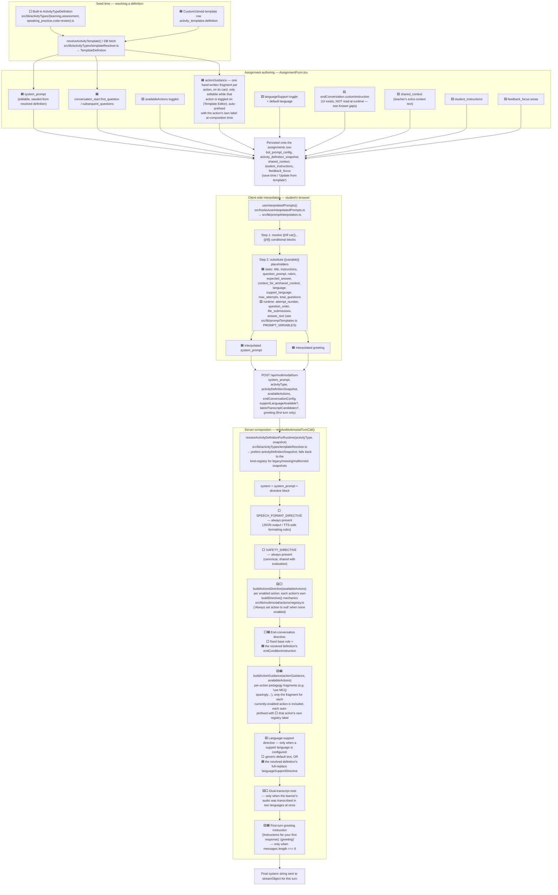
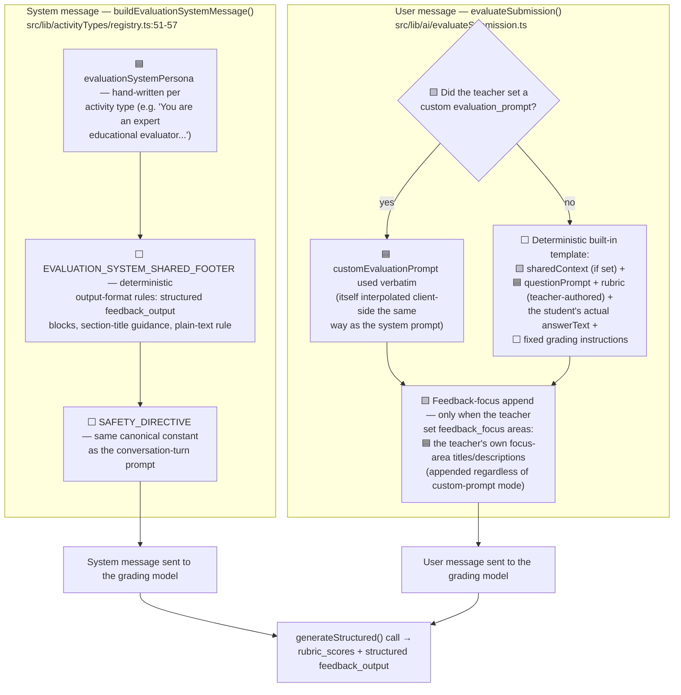

# Prompt construction flow

How the two prompts actually sent to a model — the **conversation-turn system prompt**
(multimodal tutoring turns) and the **evaluation/grading prompt** — are assembled from teacher
input, template defaults, and runtime scaffolding. Every node below cites the exact source
file/function it comes from; nothing here is aspirational.

## Legend

| Symbol | Category | Meaning |
| --- | --- | --- |
| 🟦 | **User-authored** | Free text a teacher or template author actually typed; persisted per-assignment (or per-template) and editable. |
| ⬜ | **Deterministic** | Fixed or type-selected, code-owned text. Same for every assignment of that shape; not editable per-assignment. |
| 🟨 | **Optional / conditional** | Only present when a toggle is on or a runtime condition holds. |

---

## Diagram A — Conversation-turn system prompt

### Known gaps in Diagram A

- **`endConversation.customInstruction`** (assignment-level, `EndConversationConfig`) is sent in
  the turn request body but **not currently read** when composing D4 — kept as a currently-unused
  type/UI (a deliberate Phase-0 decision — see `dev-docs/activity-templates-plan.md`).

---

## Diagram B — Evaluation / grading prompt

---

## Source files referenced

| Area | File |
| --- | --- |
| Built-in activity type definitions | `src/lib/activityTypes/{learning,assessment,speaking_practice,code-review}.ts` |
| Template resolution (registry vs. DB) | `src/lib/activityTypes/templateResolver.ts`, `src/lib/activityTypes/templates.ts` |
| Assignment authoring | `src/components/Teacher/Assignments/AssignmentForm.tsx` |
| Client-side interpolation engine | `src/hooks/useInterpolatedPrompts.ts`, `src/lib/promptInterpolation.ts`, `src/lib/promptTemplates.ts` |
| Turn request body | `src/components/Shared/AssessmentInputs/MultimodalInputArea.tsx`, `src/app/api/multimodal/turn/route.ts` |
| Server prompt composition | `src/lib/ai/chat-stream-object.ts`, `src/lib/ai/multimodal-directives.ts` |
| Per-action mechanics directives | `src/lib/multimodal/actions/registry.ts` |
| Evaluation system message | `src/lib/activityTypes/registry.ts` |
| Evaluation user message | `src/lib/ai/evaluateSubmission.ts` |
