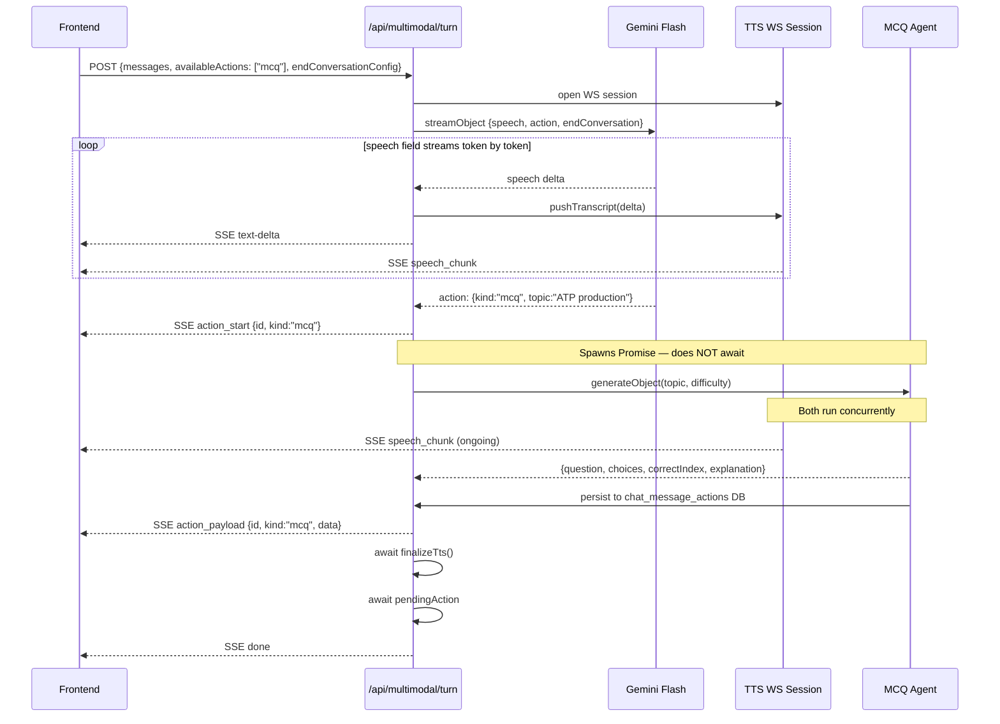
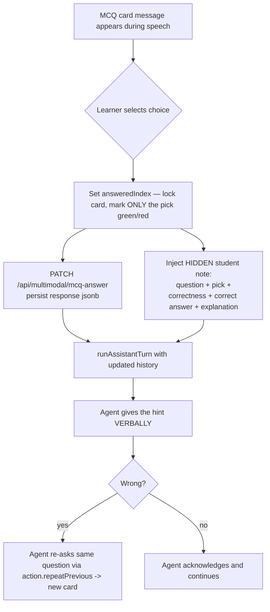

# Multimodal Orchestration Plan

Parallel content delivery for `MultimodalInputArea` — voice speech + rich pedagogical content from a single LLM call.

---

## 1. Core Architecture Decision

A single `streamObject` call replaces the current `streamText` call. The schema puts `speech` first so TTS starts streaming immediately. The `action` field resolves later in the same generation — no second LLM call, no coordination problem, transcript sent once.

```
t=0ms    → streamObject({ speech, action, endConversation }) — full transcript, one call
t=300ms  → speech field starts streaming → TTS starts immediately
t=600ms  → first word at frontend
t=1200ms → action field resolves → action agent spawns in parallel with ongoing speech
t=~1800ms→ MCQ ready, streamed to frontend while bot is still speaking
```

**Why not tool calls:** LLM pauses mid-speech waiting for tool results — unacceptable for voice.
**Why not two parallel LLMs:** No shared state — incoherent output (speech says one thing, content does another).
**Why not orchestrator-first:** Adds ~150ms before first word, requires sending transcript twice.
**Provider compatibility:** `streamObject` + speech delta extraction is provider-agnostic via Vercel AI SDK — works with OpenAI, Gemini, Anthropic. Model is resolved via existing `getLanguageModel(config)`.

---

## 2. System Architecture

```mermaid
graph TD
    U[Learner speaks] --> API[/api/multimodal/turn]

    API -->|full transcript, one call| LLM[Gemini Flash\nstreamObject]

    LLM -->|speech field streams| TTS[TTS Agent\nCartesia / Sarvam WS]
    LLM -->|action field resolves| DISPATCH[Action Dispatcher]

    DISPATCH -->|kind: mcq| MCQ[MCQ Agent\ngenerateObject]
    DISPATCH -->|kind: image — future| IMG[Image Agent]
    DISPATCH -->|kind: video — future| VID[Video Agent]
    DISPATCH -->|kind: equation — future| EQ[Equation Agent]

    TTS -->|speech_start/chunk/end SSE| FE[Frontend]
    MCQ -->|action_start / action_payload SSE| FE
    IMG -->|action_start / action_payload SSE| FE
```

---

## 3. Sequence Diagram



---

## 4. SSE Protocol

### Existing events (unchanged)
```ts
| { type: "text-delta"; content: string }
| { type: "speech_start"; index?: number; sampleRate?: number }
| { type: "speech_chunk"; index?: number; base64: string }
| { type: "speech_end"; index?: number }
| { type: "end_conversation"; reason: "thorough" | "refusal" }
| { type: "done" }
| { type: "error"; error?: string; message?: string }
```

### New events (generic — designed for all future action types, only MCQ in Phase 1)
```ts
| { type: "action_start";   id: string; kind: ActionKind }
| { type: "action_payload"; id: string; kind: ActionKind; data: ActionPayload }
| { type: "action_error";   id: string; kind: ActionKind; error: string }
```

```ts
// Extend as new action types are added
type ActionKind = "mcq" | "image" | "video" | "equation" | "animation";

type ActionPayload =
  | { kind: "mcq"; question: string; choices: string[]; correctIndex: number; explanation?: string }
  // future:
  | { kind: "image"; url: string; altText?: string }
  | { kind: "video"; url: string; title?: string }
  | { kind: "equation"; latex: string; display: "inline" | "block" }
  | { kind: "animation"; animationId: string; params?: Record<string, unknown> };
```

`action_start` always precedes `action_payload` for a given `id`. `action_error` replaces `action_payload` on failure — frontend discards the skeleton silently.

---

## 5. Backend Changes

### 5a. Request Body

```ts
interface MultimodalTurnRequestBody {
  // existing fields unchanged
  assignmentId: string;
  submissionId?: string;
  questionOrder: number;
  messages: MultimodalTurnMessage[];
  attemptNumber?: number;
  system_prompt: string;
  greeting?: string;        // still used — injected as first assistant message when history is empty
  language: string;
  ttsModelId: string;
  // new
  availableActions?: ActionKind[];       // teacher-configured, defaults to []
  endConversationConfig?: EndConversationConfig;
}

interface EndConversationConfig {
  // Optional extra guidance only. The default behavior (end on thorough
  // completion or learner refusal) is always applied server-side.
  customInstruction?: string;   // e.g. "wrap up once the student demonstrates understanding"
}
```

### 5b. `turnSchema`

One action per turn maximum — keeps the conversation uncluttered and makes reveal timing straightforward.

```ts
const turnSchema = z.object({
  speech: z.string().describe(
    "The full conversational response to speak aloud. Complete sentences only."
  ),
  action: z.discriminatedUnion("kind", [
    z.object({
      kind: z.literal("mcq"),
      topic: z.string(),
      difficulty: z.enum(["easy", "medium", "hard"]).default("medium"),
    }),
    // Add new action schemas here as they are implemented:
    // z.object({ kind: z.literal("image"), query: z.string() }),
    // z.object({ kind: z.literal("equation"), latex: z.string() }),
  ]).nullable().describe(
    "A single content action to show the learner, or null if none needed."
  ),
  endConversation: z.enum(["thorough", "refusal"]).nullable().describe(
    "Set to 'thorough' when the conversation end condition is met, 'refusal' if the learner is off-topic, null otherwise."
  ),
});
```

When `availableActions` is empty, use `action: z.null()` so the LLM never generates actions.

### 5c. Streaming Loop (replaces current `streamText` loop)

```ts
const { partialObjectStream } = streamObject({
  model,
  system: systemPrompt,  // includes end condition + available actions instructions
  messages: sdkMessages, // full transcript; greeting injected as first assistant message if history empty
  schema: turnSchema,
});

let lastSpeechLength = 0;
let actionDispatched = false;
let pendingAction: Promise<void> | null = null;

for await (const partial of partialObjectStream) {
  if (aborted) break;

  // Speech streams token by token → same TTS path as today
  if (partial.speech) {
    const delta = partial.speech.slice(lastSpeechLength);
    if (delta) {
      fullReply += delta;
      enqueue({ type: "text-delta", content: delta });
      pushToTts(delta);  // Cartesia/Sarvam WS or fallback sentence-flush
      lastSpeechLength = partial.speech.length;
    }
  }

  // Single action — dispatch as soon as the action object is complete
  if (!actionDispatched && partial.action?.kind) {
    actionDispatched = true;
    const actionId = crypto.randomUUID();
    enqueue({ type: "action_start", id: actionId, kind: partial.action.kind });
    pendingAction = dispatchAction({
      id: actionId,
      action: partial.action,
      enqueue,
      submissionId,
      chatMessageId,  // ID of the assistant chat_message row, inserted after fullReply is known
    }).catch((err) => {
      enqueue({
        type: "action_error",
        id: actionId,
        kind: partial.action!.kind,
        error: err instanceof Error ? err.message : "Action failed",
      });
    });
  }

  // End conversation
  if (partial.endConversation) {
    endConversationReason = partial.endConversation;
    enqueue({ type: "end_conversation", reason: partial.endConversation });
  }
}

await finalizeTts();
if (pendingAction) await pendingAction;
enqueue({ type: "done" });
```

### 5d. Action Dispatcher (extensible registry)

```ts
// lib/multimodal/actions/dispatcher.ts

interface DispatchActionArgs {
  id: string;
  action: ActionUnion;
  enqueue: EnqueueFn;
  submissionId: string;
  chatMessageId: string;
}

export async function dispatchAction(args: DispatchActionArgs): Promise<void> {
  switch (args.action.kind) {
    case "mcq":
      return handleMcqAction(args);
    // future:
    // case "image": return handleImageAction(args);
    // case "equation": return handleEquationAction(args);
    default:
      throw new Error(`Unknown action kind: ${(args.action as { kind: string }).kind}`);
  }
}
```

### 5e. MCQ Action Handler

Saves to DB before enqueuing SSE — payload survives even if the client disconnects mid-stream.

```ts
// lib/multimodal/actions/mcq.ts

export async function handleMcqAction({
  id, action, enqueue, submissionId, chatMessageId,
}: DispatchActionArgs): Promise<void> {
  const result = await generateObject({
    model,
    system: "Generate a multiple choice question. Return only valid JSON.",
    prompt: `Topic: ${action.topic}\nDifficulty: ${action.difficulty}`,
    schema: z.object({
      question: z.string(),
      choices: z.array(z.string()).length(4),
      correctIndex: z.number().int().min(0).max(3),
      explanation: z.string(),
    }),
  });

  const payload = { kind: "mcq" as const, ...result.object };

  // Persist before streaming — survives interruption
  await insertChatMessageAction(supabase, {
    id,
    chatMessageId,
    submissionId,
    kind: "mcq",
    payload,
  });

  enqueue({ type: "action_payload", id, kind: "mcq", data: payload });
}
```

### 5f. DB Schema Addition

```sql
create table chat_message_actions (
  id              uuid primary key,
  chat_message_id uuid not null references chat_messages(id) on delete cascade,
  submission_id   text,                     -- denormalized convenience (also reachable via chat_message_id)
  kind            text not null,            -- 'mcq' | 'image' | 'equation' | ...
  payload         jsonb not null,           -- system-generated content (written once)
  response        jsonb,                    -- learner interaction (nullable), generic per kind
  created_at      timestamptz default now()
);
```

`payload` = what the system generated (immutable). `response` = what the learner did (nullable, written on interaction) — generic across kinds: MCQ → `{ answeredIndex }`, future poll → `{ selected: [...] }`, etc. `where response is not null` answers "was this acted on?" for any kind. Correctness analytics: `where (response->>'answeredIndex')::int = (payload->>'correctIndex')::int`.

---

## 6. Frontend Changes

### 6a. Extended types

```ts
interface ChatMessage {
  id: string;
  role: "student" | "assistant";
  content: string;
  status?: "transcribing";
  action?: PendingAction;   // single action per message, matches one-per-turn rule
}

interface PendingAction {
  id: string;
  kind: ActionKind;
  state: "loading" | "ready" | "error";
  payload?: ActionPayload;
  answeredIndex?: number;   // MCQ: set when learner selects a choice, locks the card
}
```

### 6b. Handling new SSE events in `parseMultimodalTurnStream`

```ts
} else if (event.type === "action_start") {
  setMessages(prev => prev.map(m =>
    m.id === currentAssistantId
      ? { ...m, action: { id: event.id, kind: event.kind, state: "loading" } }
      : m
  ));
} else if (event.type === "action_payload") {
  setMessages(prev => prev.map(m =>
    m.id === currentAssistantId && m.action?.id === event.id
      ? { ...m, action: { ...m.action, state: "ready", payload: event.data } }
      : m
  ));
} else if (event.type === "action_error") {
  setMessages(prev => prev.map(m =>
    m.id === currentAssistantId && m.action?.id === event.id
      ? { ...m, action: undefined }
      : m
  ));
}
```

**On interruption** — strip any `"loading"` skeleton so no ghost card remains:

```ts
// In handleMicPress interruption path, after abort
setMessages(prev => prev.map(m =>
  m.action?.state === "loading" ? { ...m, action: undefined } : m
));
```

### 6c. Action message + reveal timing

Each action is its **own** standalone message (`content:""`, `action` set) — not attached to the speech bubble. On `action_start` the speech message is committed first (so it precedes the card), then the card message is appended, so the MCQ card appears **while the agent is still speaking** (audio still playing). `action_payload` flips it to ready; `action_error` removes it. Interruption strips `state:"loading"` card messages.

### 6d. MCQ answer flow



The note is `hidden` — sent to the LLM but not rendered, not in the eval transcript, and not logged to `chat_messages`. The card never reveals the correct answer or an explanation; the tutor delivers the hint by voice. Retry re-shows the **same** question (`repeatPrevious` reuses the stored payload) as a new card.

### 6e. `ActionCard` component (extensible)

Action-only messages render as just the card (no speech bubble chrome) and persist in the scroll history. Answered MCQs show only the learner's pick marked (green+check / red+X) — the correct answer is not highlighted.

```ts
// components/Shared/KonvoVoice/ActionCard.tsx

interface ActionCardProps {
  action: PendingAction;
  isSpeaking: boolean;
  onMcqAnswer: (index: number) => void;
}

export function ActionCard({ action, isSpeaking, onMcqAnswer }: ActionCardProps) {
  if (action.state === "loading") return <ActionSkeleton kind={action.kind} />;

  const speechGated = action.payload?.kind === "mcq" && isSpeaking;
  if (speechGated) return <ActionSkeleton kind="mcq" />;

  switch (action.payload?.kind) {
    case "mcq":
      return (
        <MCQCard
          payload={action.payload}
          answeredIndex={action.answeredIndex}
          onAnswer={action.answeredIndex === undefined ? onMcqAnswer : undefined}
        />
      );
    // future:
    // case "image": return <ImageCard payload={action.payload} />;
    // case "equation": return <EquationCard payload={action.payload} />;
    default: return null;
  }
}
```

---

## 7. Teacher Configuration

```ts
interface ActivityActionConfig {
  mcq?: { enabled: boolean };
  image?: { enabled: boolean; source?: "library" | "generate" };  // future
  video?: { enabled: boolean; libraryIds?: string[] };             // future
  equation?: { enabled: boolean };                                  // future
}

interface EndConversationConfig {
  customInstruction?: string;   // optional; augments the always-on default
}
```

Config flows through:

```
DB / assignment settings
  → botPromptConfig { availableActions, endConversationConfig }
    → useInterpolatedPrompts → system prompt
      → MultimodalInputArea → POST body
        → /api/multimodal/turn → turnSchema + system prompt
```

System prompt includes both the list of available actions and the end condition so the LLM knows what it can do and when to stop.

---

## 8. Implementation Phases

### Phase 1 — MCQ + Teacher Config

**Step 0 — Validate `streamObject` streaming first — ✅ DONE**
- [x] Spike against `gemini-3-flash-preview` (thinking minimal): `partial.speech` streamed in 3 progressive, sentence-sized chunks (50 / 162 / 98 chars), first delta ~2s, **not** buffered to the end.
- [x] Speech reliably precedes the `action` field resolving → parallel dispatch holds.
- [x] Sentence-sized chunks are fully compatible with the WS continuation sessions and `shouldFlushFallbackTtsChunk` (which flushes at ~120 chars / sentence boundaries anyway) — arguably better prosody than token-by-token.
- [x] Fallback (`streamText` + parallel `generateObject`) **not needed**. Spike deleted after recording this result.

**Backend**
- [ ] Replace `streamText` with `streamObject` in `/api/multimodal/turn`
- [ ] `turnSchema`: `speech` + nullable `action` + nullable `endConversation`
- [ ] Migrate `end_conversation` from tool call to `endConversation` schema field
- [ ] `dispatchAction` registry (`lib/multimodal/actions/dispatcher.ts`)
- [ ] `handleMcqAction` using `generateObject` (`lib/multimodal/actions/mcq.ts`)
- [ ] `chat_message_actions` DB table (migration)
- [ ] `handleMcqAction` persists payload to DB before SSE enqueue
- [ ] `PATCH /api/multimodal/mcq-answer` — persists `answered_index` + `answered_at`
- [ ] `availableActions` + `endConversationConfig` wired through to schema + system prompt

**Frontend**
- [ ] `ChatMessage.action?: PendingAction` + `PendingAction.answeredIndex?`
- [ ] Handle `action_start / action_payload / action_error` in `parseMultimodalTurnStream`
- [ ] Strip `"loading"` action on interruption
- [ ] `ActionCard` + `ActionSkeleton` components
- [ ] `MCQCard` — unanswered and locked/answered states
- [ ] MCQ answer → lock card → persist via `PATCH` → inject synthetic message → `runAssistantTurn`
- [ ] MCQ card persists in scroll history after answering

**Teacher config**
- [ ] `ActivityActionConfig` + `EndConversationConfig` persisted with assignment in DB
- [ ] MCQ on/off toggle in assignment settings UI
- [ ] Optional "ending guidance" textarea (default end-on-thorough/refusal is always on; no turn-count selector)
- [ ] Config flows through `botPromptConfig` → `useInterpolatedPrompts`

### Phase 2 — Image + Equation
- [ ] Add `image` + `equation` to `turnSchema` discriminated union
- [ ] `handleImageAction` (library lookup) + `handleEquationAction` (LaTeX passthrough)
- [ ] Both persist to `chat_message_actions`
- [ ] `ImageCard` + `EquationCard` (reveal immediately, no speech gate)
- [ ] Teacher toggle UI for image + equation

### Phase 3 — Video + Animation
- [ ] Video library DB + query handler
- [ ] `VideoCard` with asset preload on `action_start`
- [ ] Animation registry + `AnimationCard`
- [ ] Teacher toggle UI for video + animation

---

## 9. Decisions Made

| Question | Decision |
|----------|----------|
| Architecture | Single `streamObject` call — `speech` streams to TTS, `action` spawns agent in parallel |
| Actions per turn | One maximum — `action` is a nullable field, not an array |
| `end_conversation` | Migrated from tool call to `endConversation` schema field |
| End condition config | Always-on default: end on thorough completion or refusal (via `endConversation` schema field + server directive). Teacher may add optional custom guidance; no turn-count config |
| Action persistence | `chat_message_actions` table; handler saves before SSE enqueue |
| MCQ answer persistence | `PATCH /api/multimodal/mcq-answer` writes `{ answeredIndex }` to the action's generic `response` jsonb column (separate from system-generated `payload`) |
| Interruption — loading actions | Strip `"loading"` skeleton; payload safe in DB |
| Interruption — delivered actions | Persist in scroll history; already delivered |
| LLM flow on interruption | Not disrupted — next turn starts a fresh `streamObject` call |
| MCQ is its own message | Standalone action-only message, appended on `action_start`; appears while the agent is still speaking |
| MCQ card persistence | Stays in scroll history; `answeredIndex` locks it; only the learner's pick is marked (no correct-answer reveal, no on-card hint) |
| MCQ answer feedback | Hint delivered verbally by the agent via `runAssistantTurn` |
| MCQ result to tutor | HIDDEN message (`hidden:true`) with pick + correctness + correct answer + explanation; sent to LLM but not rendered, not logged to `chat_messages` |
| MCQ Q&A in evaluation | `formatFullStudentTranscript` reconstructs answered MCQs (question + selection + correctness) from the card messages into `{{answer_text}}` |
| MCQ retry | Same question re-shown via `action.repeatPrevious` (reuses stored payload); agent decides when to stop |
| `formatFullStudentTranscript` | MCQ answer injections included — richer signal for evaluator |
| Teacher config timing | Ships in Phase 1 alongside MCQ |
| Provider compatibility | `streamObject` is provider-agnostic via Vercel AI SDK |
| Transcript size | Gemini Flash has 1M token context — full transcript sent every turn, no summarization needed |

---

## 10. Future Improvements

- **Accessibility**: MCQ should be keyboard-navigable and ARIA-labelled (`role="radiogroup"`, `aria-checked`, etc.) for ears-on/eyes-off learners. Not blocking Phase 1.
