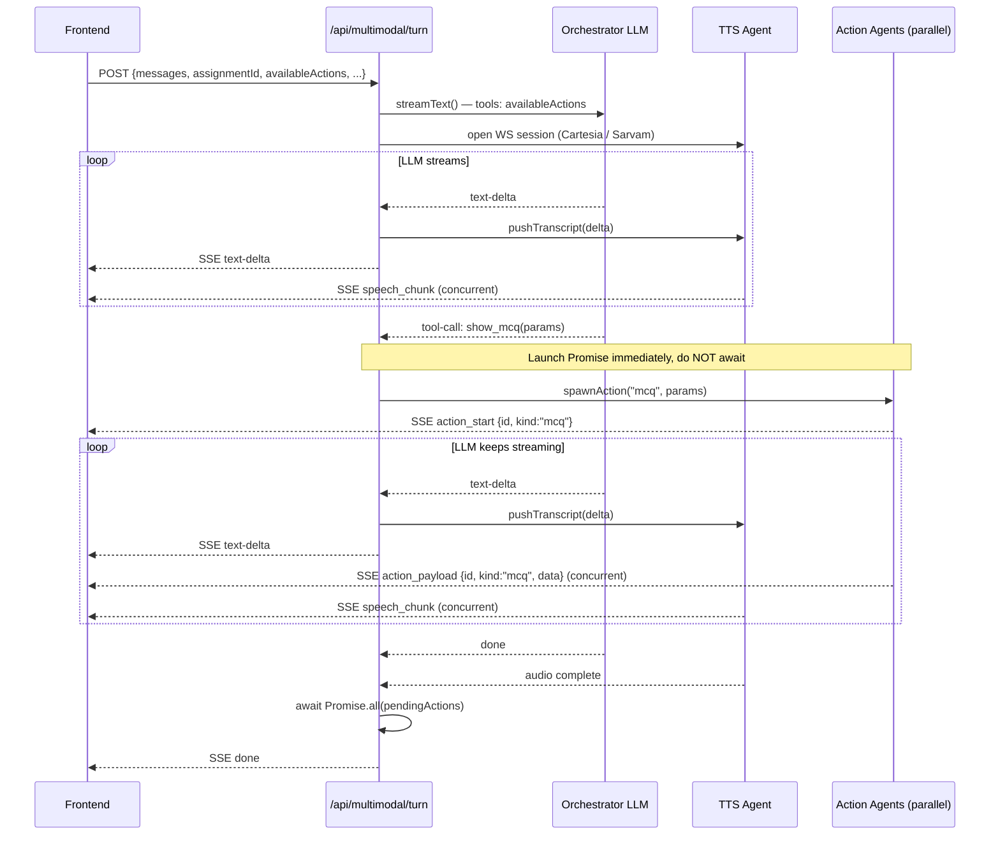
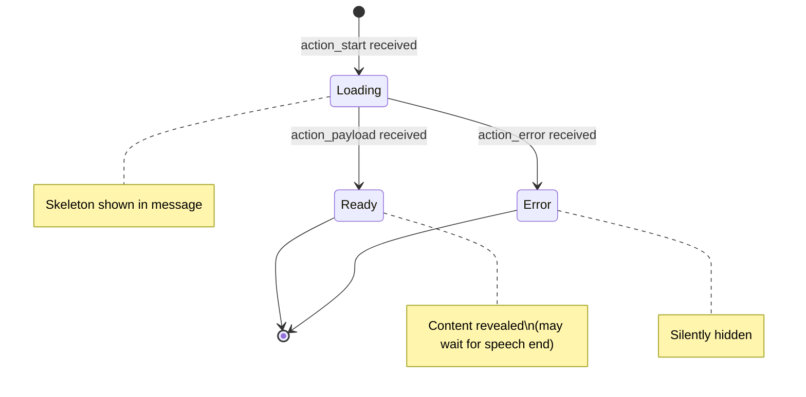
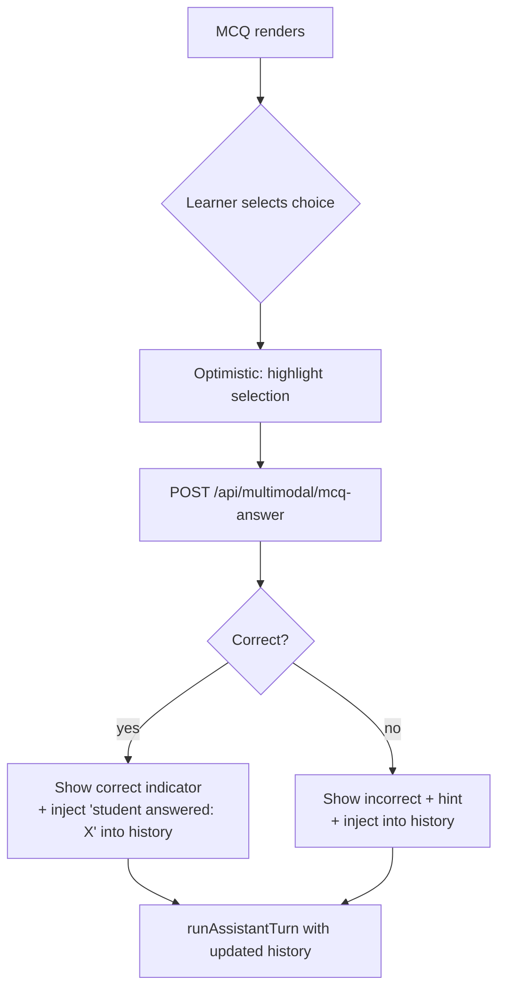

# Multimodal Orchestration Plan

Parallel-agent architecture for rich pedagogical content delivery in `MultimodalInputArea`.

---

## 1. Overview

The learner has a voice conversation with an AI tutor. While the AI is speaking, a parallel content pipeline fires simultaneously — generating MCQs, fetching images, rendering equations, or queuing videos — so that by the time the speech ends, visual content is ready to reveal. Teachers configure which content actions are available per activity.

---

## 2. High-Level Architecture

```mermaid
graph TD
    U[Learner speaks] --> T[/api/multimodal/turn]
    T --> ORCH[Orchestrator LLM\nstreams text + tool calls]

    ORCH -->|text-delta stream| TTS[TTS Agent\nCartesia / Sarvam WS]
    ORCH -->|tool call: show_image| IMG[Image Agent\ngen or library lookup]
    ORCH -->|tool call: show_mcq| MCQ[MCQ Agent\ngenerate question + choices]
    ORCH -->|tool call: show_video| VID[Video Agent\nquery curated library]
    ORCH -->|tool call: show_equation| EQ[Equation Agent\ngenerate LaTeX]
    ORCH -->|tool call: end_conversation| FIN[Finish Handler\nexisting]

    TTS -->|speech_start/chunk/end| SSE[SSE Multiplexer]
    IMG -->|action_start / action_payload| SSE
    MCQ -->|action_start / action_payload| SSE
    VID -->|action_start / action_payload| SSE
    EQ -->|action_start / action_payload| SSE

    SSE -->|single SSE stream| FE[Frontend\nMultimodalInputArea]
```

**Key principle:** Tool calls from the LLM fire their handlers immediately as `Promise`s — no `await`. The LLM stream + all action agents run concurrently. The route only awaits all pending action promises *after* the LLM stream closes.

---

## 3. Parallel Execution Model



---

## 4. SSE Protocol Extension

### New Event Types

Extend `MultimodalTurnEvent` in the frontend:

```ts
type MultimodalTurnEvent =
  // --- existing ---
  | { type: "text-delta"; content: string }
  | { type: "end_conversation"; reason: "thorough" | "refusal" }
  | { type: "speech_start"; index?: number; sampleRate?: number }
  | { type: "speech_chunk"; index?: number; base64: string }
  | { type: "speech_end"; index?: number }
  | { type: "done" }
  | { type: "error"; error?: string; message?: string }
  // --- new ---
  | { type: "action_start"; id: string; kind: ActionKind }
  | { type: "action_payload"; id: string; kind: ActionKind; data: ActionPayload }
  | { type: "action_error"; id: string; kind: ActionKind; error: string };

type ActionKind = "mcq" | "image" | "video" | "equation" | "animation";

type ActionPayload =
  | { kind: "mcq"; question: string; choices: string[]; correctIndex: number; explanation?: string }
  | { kind: "image"; url: string; altText?: string; sourceLabel?: string }
  | { kind: "video"; url: string; title?: string; startSeconds?: number }
  | { kind: "equation"; latex: string; display: "inline" | "block" }
  | { kind: "animation"; animationId: string; params?: Record<string, unknown> };
```

### Event Ordering Contract

- `action_start` always arrives before `action_payload` for a given `id`
- `action_payload` may arrive *while speech is still playing* — frontend should reveal content after speech ends for that turn, not immediately (configurable per action kind)
- `action_error` replaces `action_payload` when an agent fails; frontend discards the skeleton

---

## 5. Backend: Route Changes (`/api/multimodal/turn`)

### 5a. Request Body Addition

```ts
interface MultimodalTurnRequestBody {
  // ... existing fields ...
  availableActions?: ActionKind[];  // teacher-configured list
}
```

### 5b. Tool Definitions (passed to LLM)

```ts
const PEDAGOGICAL_TOOLS = {
  show_mcq: {
    description: "Present the learner with a multiple-choice question to check understanding.",
    parameters: z.object({
      topic: z.string(),
      difficulty: z.enum(["easy", "medium", "hard"]).optional(),
    }),
  },
  show_image: {
    description: "Display a relevant image or diagram to support the explanation.",
    parameters: z.object({
      query: z.string().describe("Search query or description for the image"),
      source: z.enum(["library", "generate"]).default("library"),
    }),
  },
  show_video: {
    description: "Queue a short video clip from the curated content library.",
    parameters: z.object({
      topic: z.string(),
      maxDurationSeconds: z.number().optional(),
    }),
  },
  show_equation: {
    description: "Render a mathematical equation.",
    parameters: z.object({
      latex: z.string(),
      display: z.enum(["inline", "block"]).default("block"),
    }),
  },
  end_conversation: { /* existing */ },
};

// Filter by availableActions from request
function buildTools(availableActions: ActionKind[]) {
  return Object.fromEntries(
    Object.entries(PEDAGOGICAL_TOOLS).filter(
      ([key]) => key === "end_conversation" || availableActions.includes(key as ActionKind)
    )
  );
}
```

### 5c. Parallel Action Dispatch (inside the SSE ReadableStream)

```ts
const pendingActions: Promise<void>[] = [];

// In the LLM stream loop, on "tool-call":
case "tool-call": {
  if (part.toolName === "end_conversation") {
    // ... existing handling ...
  } else {
    const actionId = crypto.randomUUID();
    enqueue({ type: "action_start", id: actionId, kind: part.toolName as ActionKind });

    // Fire and collect — do NOT await here
    const actionPromise = handleAction(actionId, part.toolName, part.input, enqueue)
      .catch((err) => {
        enqueue({ type: "action_error", id: actionId, kind: part.toolName, error: err.message });
      });
    pendingActions.push(actionPromise);
  }
  break;
}

// After LLM stream + TTS finish:
await Promise.all(pendingActions);
enqueue({ type: "done" });
```

### 5d. Action Handlers

Each handler is an `async function` that calls the appropriate API and enqueues the result:

```ts
async function handleAction(
  id: string,
  kind: string,
  input: unknown,
  enqueue: (data: Record<string, unknown>) => void,
): Promise<void> {
  switch (kind) {
    case "show_mcq": return handleMcqAction(id, input, enqueue);
    case "show_image": return handleImageAction(id, input, enqueue);
    case "show_video": return handleVideoAction(id, input, enqueue);
    case "show_equation": return handleEquationAction(id, input, enqueue);
  }
}

async function handleMcqAction(id, input, enqueue) {
  // Call a separate LLM prompt to generate the MCQ JSON
  const mcq = await generateMcq(input.topic, input.difficulty);
  enqueue({ type: "action_payload", id, kind: "mcq", data: mcq });
}

async function handleEquationAction(id, input, enqueue) {
  // Equation is already fully specified by the LLM tool call
  enqueue({ type: "action_payload", id, kind: "equation", data: input });
}
```

---

## 6. Frontend State Changes

### 6a. ChatMessage Extension

```ts
interface ChatMessage {
  id: string;
  role: "student" | "assistant";
  content: string;
  status?: "transcribing";
  actions?: PendingAction[];   // NEW
}

interface PendingAction {
  id: string;
  kind: ActionKind;
  state: "loading" | "ready" | "error";
  payload?: ActionPayload;
  error?: string;
}
```

### 6b. Frontend Action Lifecycle



### 6c. Reveal Timing by Action Kind

| Kind | Reveal timing |
|------|---------------|
| `equation` | Immediately when `action_payload` arrives |
| `image` | Immediately when `action_payload` arrives |
| `mcq` | After speech ends (bot turn complete) |
| `video` | After speech ends |
| `animation` | After speech ends |

This prevents the MCQ from appearing mid-sentence before the bot has finished framing the question verbally.

### 6d. MCQ Answer Flow



The MCQ answer is injected as a synthetic student message so the conversation history remains coherent for the LLM.

---

## 7. Teacher Configuration

### 7a. Schema (extends existing `botPromptConfig`)

```ts
interface BotPromptConfig {
  // ... existing fields ...
  availableActions?: ActivityActionConfig;
}

interface ActivityActionConfig {
  mcq?: {
    enabled: boolean;
    maxChoices?: number;          // 2-5, default 4
    allowHints?: boolean;
  };
  image?: {
    enabled: boolean;
    source: "library" | "generate" | "both";
    libraryIds?: string[];        // restrict to curated set
  };
  video?: {
    enabled: boolean;
    libraryIds?: string[];
    maxDurationSeconds?: number;
  };
  equation?: {
    enabled: boolean;
  };
  animation?: {
    enabled: boolean;
    allowedAnimationIds?: string[];
  };
}
```

### 7b. Teacher UI (conceptual)

```
Activity Settings → Content Actions

  ☑ MCQ Questions
      Max choices: [4 ▾]    Allow hints: [yes ▾]

  ☑ Images
      Source: [Library only ▾]
      [ + Add image library ]

  ☐ Video Clips
  ☐ Equations
  ☐ Animations
```

The enabled action kinds get serialized into `botPromptConfig.availableActions` and persisted with the assignment. The frontend passes them through `useInterpolatedPrompts` → turn API request → tool definitions passed to LLM.

---

## 8. Data Flow Summary

```mermaid
flowchart LR
    subgraph Teacher
        TC[Activity Config\navailableActions]
    end

    subgraph Frontend
        IIP[useInterpolatedPrompts\nreads botPromptConfig]
        MIA[MultimodalInputArea\nhandleMicPress]
        RENDER[ContentBox\n+ ActionCard components]
    end

    subgraph API
        TURN[/api/multimodal/turn]
        TOOLS[buildTools\nfiltered by availableActions]
        DISPATCH[handleAction\nparallel Promises]
    end

    subgraph External
        LLM_EXT[LLM\nstreamText + toolChoice]
        TTS_EXT[TTS\nCartesia/Sarvam WS]
        IMG_EXT[Image API]
        VID_DB[Video Library DB]
    end

    TC --> IIP
    IIP --> MIA
    MIA -->|POST availableActions| TURN
    TURN --> TOOLS
    TOOLS --> LLM_EXT
    LLM_EXT -->|text-delta| TTS_EXT
    LLM_EXT -->|tool-call| DISPATCH
    DISPATCH --> IMG_EXT
    DISPATCH --> VID_DB
    TTS_EXT -->|speech_chunk SSE| RENDER
    DISPATCH -->|action_payload SSE| RENDER
```

---

## 9. New API Routes Needed

| Route | Purpose |
|-------|---------|
| `POST /api/multimodal/mcq-answer` | Validate MCQ answer, return feedback |
| `POST /api/multimodal/action/image` | Image lookup / generation (called internally by action handler) |
| `POST /api/multimodal/action/video` | Video library query |
| `POST /api/multimodal/action/mcq` | MCQ generation via LLM (called internally) |

Internal action routes are server-to-server (same Next.js process, can be direct function calls rather than HTTP).

---

## 10. Implementation Phases

### Phase 1 — Protocol + Equation/Image (stateless actions)
- [ ] Add `action_start / action_payload / action_error` SSE event types
- [ ] Add `handleAction` + parallel `Promise` dispatch to `/api/multimodal/turn`
- [ ] Implement `show_equation` tool (no external call, LLM provides LaTeX directly)
- [ ] Implement `show_image` tool (library lookup by query)
- [ ] Frontend: extend `ChatMessage` with `actions[]`; render `EquationCard` and `ImageCard`
- [ ] Reveal equations/images immediately on `action_payload`

### Phase 2 — MCQ
- [ ] Implement `show_mcq` tool + `handleMcqAction` (secondary LLM call)
- [ ] `POST /api/multimodal/mcq-answer` route
- [ ] Frontend: `MCQCard` component with selection state
- [ ] Answer injection into conversation history
- [ ] Reveal MCQ after speech ends (gate on `bot_turn_complete`)

### Phase 3 — Teacher Config UI
- [ ] `ActivityActionConfig` schema in DB / assignment config
- [ ] Settings UI: checklist with per-action options
- [ ] Pass `availableActions` through `botPromptConfig` → `useInterpolatedPrompts` → API

### Phase 4 — Video + Animation
- [ ] Video library DB + query route
- [ ] `VideoCard` embed component
- [ ] Animation registry + `AnimationCard` component
- [ ] Preloading: `action_start` triggers asset prefetch before reveal

---

## 11. Open Questions

1. **MCQ generation latency**: Secondary LLM call for MCQ may take 2-4s. Should the skeleton show a spinner or should the bot verbally say "let me prepare a question" to buy time?

2. **Action ordering on screen**: If two actions fire in the same turn (image + equation), should they appear in tool-call order or arrival order?

3. **Persistence**: Should action payloads be stored in the DB alongside chat messages? Needed for session replay / review.

4. **Interruption handling**: If the learner interrupts the bot mid-speech, pending actions that haven't delivered yet — discard or still reveal?

5. **Accessibility**: MCQ and image content must be narrated or have ARIA labels so the experience works without screen interaction (learner may be eyes-off).
